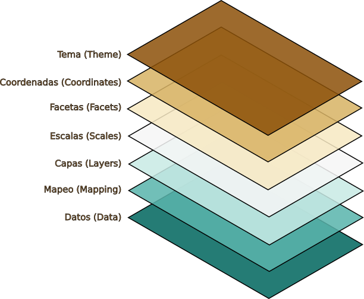
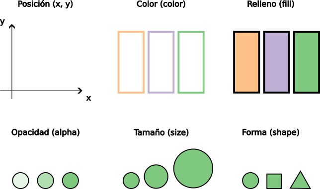

# Cantidades {#sec-amounts}

```{r}
#| echo: false
source("_common.R")
```

```{r}
#| label: load-r-packages
#| echo: false
#| message: false
library(tidyverse)
```

Este capítulo se basa en [@wickham_ggplot2_2016] y [@wilke_fundamentals_2019] así como en la documentación oficial de [`ggplot2`](https://ggplot2.tidyverse.org/articles/ggplot2.html) donde tiene como propósito introducir el modelo mental de **la gramática de gráficos en capas** (**layered grammar of graphics**, [@wickham_layered_2010]) para visualizar variables numéricas a través de un conjunto de categorías utilizando el paquete `ggplot2` e información de los resultados del examen [Saber Pro](https://www.icfes.gov.co/evaluaciones-icfes/acerca-del-examen-saber-pro/) del grupo de competencias genéricas correspondientes a programas de pregrado de la Facultad de Estudios a Distancia (FAEDIS) de la Universidad Militar Nueva Granada (UMNG).

Exploraremos los siguientes aspectos:

1. ¿Qué es la gramática de gráficos en capas?
2. ¿Qué elementos componen la gramática de gráficos en capas?
3. ¿Cómo visualizar variables numéricas para un conjunto de categorías?

:::: {#nte-1-chap-6 .callout-note}
Para desarrollar el contenido de este capítulo es necesario que descarges el archivo señalado a continuación:
   
::: {.callout appearance="minimal"}
## {fig-alt="Ícono del explorador de archivos" height=25} [2021-2024_saber-pro-genericas_faedis.rds](https://github.com/luifrancgom/r-clio/raw/refs/heads/main/data/2021-2024_saber-pro-genericas_faedis.rds)
:::

Luego, genera una carpeta con el nombre `data` y dentro de esta carpeta incluye el archivo `2021-2024_saber-pro-genericas_faedis.rds`. Finalmente, genera una carpeta con el nombre `006_visualizar-cantidades-en-r` y dentro de la carpeta crea un archivo con el nombre `001_visualizar-cantidades-datos-faedis.R`, siguiendo las indicaciones descritas en la @sec-package-usage.
::::

## Gramática de gráficos en capas {#sec-layered-grammar-graphics}

El paquete `ggplot2`, incluido en el `tidyverse`, permite generar visualizaciones a partir de un conjunto de datos. Este paquete utiliza un marco conceptual basado en la gramática de gráficos desarrollada en [@wilkinson_grammar_2005]. La gramática de gráficos en capas es una adaptación de esta gramática para integrarla en el lenguaje de programación de R.

A medida que explores diferentes formas de visualizar un conjunto de datos entenderás en más detalle la gramática de gráficos en capas utilizando el paquete `ggplot2`. Por ahora se describirán de manera general las 7 capas que conforman este modelo mental (ver @fig-mental-model-layered-grammar-graphics) y que se utilizan en `ggplot2` como un conjunto de instrucciones para generar un gráfico.

{#fig-mental-model-layered-grammar-graphics fig-alt="Diagrama conceptual en perspectiva de 7 capas flotantes que ilustran el modelo mental de ggplot2. De arriba a abajo, las capas están etiquetadas en español e inglés: Tema (Theme), Coordenadas (Coordinates), Facetas (Facets), Escalas (Scales), Capas (Layers), Mapeo (Mapping) y Datos (Data). El orden visual muestra cómo los componentes se superponen verticalmente para construir un gráfico."}

Para que `ggplot2` genere un gráfico requiere como mínimo los siguientes 3 componentes: Datos, Mapeo y Capas. Los demás elementos restantes (Escalas, Facetas, Coordenadas y Tema) cuentan con valores predeterminados que eliminan inicialmente la necesidad de fijar configuraciones adicionales.

1. **Datos**: es el insumo principal que se requiere para generar un gráfico donde se refiere al conjunto de datos que se busca visualizar. `ggplot2` funciona mejor si el conjunto de datos es ordenado ([tidy data](https://tidyr.tidyverse.org/articles/tidy-data.html) en inglés, [@wickham_tidy_2014]) donde este concepto se tratará en más detalle en el @sec-data-tidying.   

2. **Mapeo**: es el conjunto de instrucciones que permiten mapear las variables de los datos a propiedades visuales denominadas atributos estéticos. En la @fig-aesthetics-attributes se indican algunos ejemplos de atributos estéticos.

{#fig-aesthetics-attributes fig-alt="Diagrama de seis cuadrantes que representan visualmente los atributos estéticos fundamentales: Posición (x, y) mediante ejes coordenados, Color (color) en los bordes, Relleno (fill) en el interior, Opacidad (alpha) con diferentes niveles de transparencia, Tamaño (size) con círculos de distinto diámetro y Forma (shape) con figuras de un círculo, un cuadrado y un triángulo."}

3. **Capas**: es el componente que toma los datos mapeados para transformarlos en una representación visual comprensible. Cada capa se compone de 3 elementos:

   a. Una **geometría** que determina como se muestran los datos a través de atributos estéticos.

   b. Una **transformación estadística** donde calcula nuevas variables a partir de los datos y afecta que parte de ellos se muestran.

   c. Un **ajuste de posición** donde determina la ubicación en la que se presentará visualmente cada dato.   

   Una capa en `ggplot2` se construye con funciones de la forma `geom_*()` o `stat_*()`.

4. **Escalas**: es el componente que traduce la información visual del gráfico de vuelta a los datos originales, utilizando los ejes y las leyendas como guías.

   En `ggplot2` las escalas se aplican usualmente mediante funciones que utilizan el patrón `scale_{aesthetic}_{type}()`, donde `{aesthetic}` corresponde a uno de los atributos estéticos utilizados en el mapeo y `{type}` una etiqueta descriptiva asignada a la escala.

   Sin embargo, existen también funciones auxiliares como `labs()` y `lims()`que permiten realizar ajustes a las etiquetas y los límites de un gráfico.

5. **Facetas**: es el componente que permite visualizar diferentes subconjuntos de datos en paneles individuales, dividiendo el gráfico principal en función de variables categóricas. 

6. **Coordenadas**: es el componente que determina cómo se combinan los atributos estéticos `x` y `y` para posicionar los elementos en el plano del gráfico. Por defecto, se utiliza el sistema de coordenadas cartesianas, pero existen [otras opciones](https://ggplot2.tidyverse.org/reference/index.html#coordinate-systems) dentro de `ggplot2`.

7. **Tema**: es el componente que se encarga de controlar cualquier elemento visual del gráfico que sea ajeno a los datos. Su función principal es determinar la apariencia estética y el estilo general del diseño del gráfico.

## Gráfico de barras mediante conteo automático

En esta sección realizarás un gráfico de barras señalando el número de inscritos al examen Saber Pro para cada programa de pregrado de la Facultad de Estudios a Distancia de la Universidad Militar en el periodo 2021-2024, tal como se indica en la @fig-1-chap-6.

```{r}
#| label: fig-1-chap-6
#| fig-cap: Resultado final de un gráfico de barras utilizando `ggplot2`
#| fig-height: 5.5
#| echo: false
saber_pro_genericas_faedis_2021_2024 <- read_rds(
  file = "data/2021-2024_saber-pro-genericas_faedis.rds"
)

ggplot(
  data = saber_pro_genericas_faedis_2021_2024,
  mapping = aes(y = fct_rev(fct_infreq(estu_prgm_academico)))
) +
  geom_bar() +
  scale_y_discrete(labels = label_wrap_gen(width = 18)) +
  labs(
    x = "Número de inscritos",
    y = NULL,
    title = "Inscritos Saber Pro por programa en FAEDIS",
    subtitle = "Perido: 2021 - 2024",
    caption = "Fuente: Data Icfes"
  )
```

### Datos

El primer componente de la gramática de gráficos en capas son los datos. En ese sentido explorarás el conjuntos de datos en `2021-2024_saber-pro-genericas_faedis.rds`. Primero, debes cargar el paquete `tidyverse` utilizando el archivo `001_visualizar-cantidades-datos-faedis.R`

```{r}
#| eval: false
# Cargar paquetes ----
library(tidyverse)
```

De esa manera puedes importar los datos para explorarlos en R como se señala a continuación teniendo en cuenta lo indicado en la @nte-1-chap-6.

```{r}
#| eval: false
# Importar datos ----
saber_pro_genericas_faedis_2021_2024 <- read_rds(
  file = "data/2021-2024_saber-pro-genericas_faedis.rds"
)
```

::: {.callout-note}
En el @sec-rds se abarcará con más detalle la importación de datos para archivos con una extensión `.rds`. Por ahora, el enfoque del @sec-amounts será la visualización de un conjunto de datos.
:::

Una vez importes el conjunto de datos, podrás darle un "vistazo" utilizando la functión `glimpse()` (ver @lst-glimpse) para identificar el número y los tipos de variables que lo componen, así como la cantidad de observaciones disponibles.

```{r}
# Inspeccionar datos ----
glimpse(saber_pro_genericas_faedis_2021_2024)
```

#### Descripción de variables

Para examinar y en particular crear un gráfico a partir de un conjunto de datos es necesario entender a que se refieren cada una de las variables que lo componen. En ese sentido, a continuación se describen cada una de las variables en `2021-2024_saber-pro-genericas_faedis.rds`:

1. **ano**: año de presentación del examen Saber Pro
2. **estu_consecutivo**: identificador (id) público del estudiante (los microdatos se encuentran anonimizados)
3. **estu_genero**: género del estudiante ($F$ para femenino y $M$ para masculino)
4. **estu_semestrecursa**: semestre que cursa el estudiante en el año de presentación del examen
5. **fami_estratovivienda**: estrato socioeconómico de la vivienda donde habita el estudiante según recibo de energía eléctrica
6. **fami_educacionmadre**: nivel educativo más alto alcanzado por la madre del estudiante
7. **fami_educacionpadre**: nivel educativo más alto alcanzado por el padre del estudiante
8. **estu_cod_depto_presentacion**: código del departamento de presentación del examen según codificación [DIVIPOLA](https://www.dane.gov.co/index.php/sistema-estadistico-nacional-sen/normas-y-estandares/nomenclaturas-y-clasificaciones/nomenclaturas/codificacion-de-la-division-politica-administrativa-de-colombia-divipola)[^chap-6-footnote-1]
9. **estu_depto_presentacion**: nombre del departamento de presentación del examen
10. **estu_cod_mcpio_presentacion**: código del municipio de presentación del examen según codificación [DIVIPOLA](https://www.dane.gov.co/index.php/sistema-estadistico-nacional-sen/normas-y-estandares/nomenclaturas-y-clasificaciones/nomenclaturas/codificacion-de-la-division-politica-administrativa-de-colombia-divipola)
11. **estu_mcpio_presentacion**: nombre del municipio de presentación del examen
12. **estu_snies_prgmacademico**: código SNIES[^chap-6-footnote-2] del programa académico que cursa el estudiante y relacionado con el examen Saber Pro que presenta
13. **estu_prgm_academico**: nombre del programa académico que cursa el estudiante y relacionado con el examen Saber Pro que presenta
14. **mod_competen_ciudada_punt**: puntaje del módulo de competencias ciudadanas obtenido por el estudiante (el rango posible es $[0, 300]$)
15. **mod_comuni_escrita_punt**: puntaje del módulo de comunicación escrita obtenido por el estudiante (el rango posible es $[0, 300]$)
16. **mod_ingles_punt**: puntaje del módulo de inglés obtenido por el estudiante (el rango posible es $[0, 300]$)
17. **mod_ingles_desem**: nivel de desempeño del módulo de inglés obtenido por el estudiante (el rango posible es $[A_1, A_2, B_1, B_2]$)
18. **mod_lectura_critica_punt**: puntaje del módulo de lectura crítica obtenido por el estudiante (el rango posible es $[0, 300]$)
19. **mod_razona_cuantitat_punt**: puntaje del módulo de razonamiento cuantitativo obtenido por el estudiante (el rango posible es $[0, 300]$)
20. **punt_global**: puntaje total obtenido por el estudiante en el grupo de competencias genéricas (este grupo comprenden los módulos de competencias ciudadanas, comunicación escrita, inglés, lectura crítica y razonamiento cuantitativo y la variable se refiere al promedio simple del puntaje de estos módulos redondeado al entero más cercano)

[^chap-6-footnote-1]: DIVIPOLA es el acrónimo de **Divi**sión **Pol**ítico **A**dministrativa de Colombia donde es una nomenclatura estandarizada, diseñada por el Departamento Administrativo Nacional de Estadística (DANE) para la identificación de Entidades Territoriales (departamentos, distritos y municipios), Áreas No Municipalizadas y Centros Poblados.

[^chap-6-footnote-2]: SNIES es el acrónimo de **S**istema **N**acional de **I**nformación de la **E**ducación **S**uperior donde el Ministerio de Educación de Colombia asígna un número de registro único a un programa académico para identificarlo (ver también @sec-tibbles).

#### `ggplot()`

Para construir la @fig-1-chap-6 se requiere en primera instancia inicializar un objeto `ggplot`. Para llevar a cabo este proceso se utiliza la función `ggplot()` y el parámetro `data` de esta función con el conjunto de datos que se busca visualizar, en este caso `saber_pro_genericas_faedis_2021_2024`:

```{r}
#| lst-label: lst-ggplot
#| lst-cap: Inicialización de un objeto `ggplot` 
#| fig-height: 5.5
ggplot(data = saber_pro_genericas_faedis_2021_2024)
```

En este paso R no genera un gráfico, simplemente genera visualmente un "lienzo" completamente vacío. El propósito en el @lst-ggplot es almacenar los datos para que sean después utilizados por otros componentes.

### Mapeo

Este componente tiene como propósito fijar un conjunto de instrucciones respecto a cómo los datos son asociados a los atributos estéticos. Para realizar el mapeo se utiliza la función `aes()` junto con el parámetro `mapping` dentro de la función `ggplot()`. Para ilustar este aspecto de manera concreta utilizaremos inicialmente la posición (ver @fig-aesthetics-attributes) asociando la coordenada `x` a la variable `estu_prgm_academico`, donde se encuentran los nombres de los programas académicos:

```{r}
#| lst-label: lst-mapping-1
#| lst-cap: Mapeo de datos hacia atributos estéticos utilizando la coordenada `x` 
#| fig-height: 5.5
ggplot(
  data = saber_pro_genericas_faedis_2021_2024,
  mapping = aes(x = estu_prgm_academico)
)
```

En el @lst-mapping-1 se fija una posición para cada nombre de los programas académicos en la coordenada `x`. Debido a la longitud de los nombres y la forma como se muestran de manera horizontal, el gráfico generado es confuso. Para solucionar este aspecto es posible utilizar de manera alternativa la coordena `y` asociándola a la variable `estu_prgm_academico`: 

```{r}
#| lst-label: lst-mapping-2
#| lst-cap: Mapeo de datos hacia atributos estéticos utilizando la coordenada `y` 
#| fig-height: 5.5
ggplot(
  data = saber_pro_genericas_faedis_2021_2024,
  mapping = aes(y = estu_prgm_academico)
)
```

### Capas

#### Geometrías

Para ilustrar el número de estudiantes inscritos por programa académico es posible utilizar la función `geom_bar()` donde a través de la longitud de un conjunto de barras y contando el número de casos para cada grupo se genera una representación gráfica de este aspecto. Para lograr lo descrito anteriormente agrega la capa `geom_bar()` utilizando el operador `+`, tal como se señala a continuación:

```{r}
#| lst-label: lst-geometry
#| lst-cap: Uso de una geometría para ilustrar gráficamente datos a través de un atributo estético
#| fig-height: 5.5
ggplot(
  data = saber_pro_genericas_faedis_2021_2024,
  mapping = aes(y = estu_prgm_academico)
) +
  geom_bar()
```

En el @lst-geometry los nombres de los programas académicos se ordenan internamente de manera alfabética y se representan al generar el gŕafico de esa forma en la coordenada `y`. Sin embargo, para facilitar la comunicación respecto al número de inscritos en relación a la variable `estu_prgm_academico` es importante ordenarla por el número de casos en cada grupo dentro del gráfico. Para ordenar `estu_prgm_academico` por el número de casos se puede utilizar la función `fct_infreq()`:

```{r}
#| lst-label: lst-fct-infreq
#| lst-cap: Uso de la función `fct_infreq()` para ordenar datos categóricos de acuerdo al número de casos
#| fig-height: 5.5
ggplot(
  data = saber_pro_genericas_faedis_2021_2024,
  mapping = aes(y = fct_infreq(estu_prgm_academico))
) +
  geom_bar()
```

La función `fct_infreq()` ordena una variable categórica por el número de casos en cada grupo empezando por el más grande y terminando por el más pequeño. En caso que se busque ordenar `estu_prgm_academico` de forma descendente desde arriba hacia abajo, se puede reversar el orden generado por la función `fct_infreq()` con la función `fct_rev()` utilizando como insumo el código del @lst-fct-infreq:

```{r}
#| lst-label: lst-fct-rev
#| lst-cap: Uso de la función `fct_rev()` para reversar el orden de datos categóricos previamente ordenados
#| fig-height: 5.5
ggplot(
  data = saber_pro_genericas_faedis_2021_2024,
  mapping = aes(y = fct_rev(fct_infreq(estu_prgm_academico)))
) +
  geom_bar()
```

#### Transformaciones estadísticas {#sec-stats}

En el @lst-help se señaló la forma de consultar la documentación de un conjunto de datos que pertenece a un paquete utilizando el símbolo `?`. De la misma forma, es posible también realizar este proceso con una función. Si se examina la documentación de la función `geom_bar()` con `?geom_bar` en la sección **Usage** es posible verificar que se encuentra el parámetro `stat` con el argumento `"count"`, como `stat = "count"`. Esta opción es la que permite que la función `geom_bar()` realice un conteo del número de casos dentro de la variable `estu_prgm_academico` para generar la representación gráfica mediante la longitud de un conjunto de barras utilizando el código en el @lst-fct-rev.

#### Ajustes de posición

Al igual que en la @sec-stats si examinas la documentación de la función `geom_bar()` en la sección **Usage** se puede también encontrar el parámetro `position` con el argumento `"stack"`, como `position = "stack"`. En el @sec-distributions se explorará, con otra tipo de geometría, cómo se puede utilizar este ajuste de posición para agregar información adicional dentro de un gráfico. Por ahora, en el @sec-amounts no se profundizará respecto al uso de ajustes de posición. 

### Escalas

Este componente permite interpretar lo que se muestra en el gráfico a partir de etiquetas y leyendas. En el gráfico generado en el @lst-fct-rev las etiquetas correspondientes a los nombres de los programas en la coordenada `y` tienen una longitud demasiado extensa donde abarcan la mayor área del gráfico, opacando la información que se busca resaltar respecto al número de inscritos por programa. Para corregir este aspecto, se puede utilizar la función `scale_y_discrete()` utilizando el parámetro `labels` y la función auxiliar `label_wrap_gen()` con el propósito de limitar el ancho de los nombres de los programas que se señalan en el gráfico. Utilizando de nuevo el operador `+`, como en el @lst-geometry, puedes agregar este componente de la siguiente manera:

```{r}
#| lst-label: lst-scales
#| lst-cap: Uso de una escala para modificar las etiquetas en la coordenada `y`
#| fig-height: 5.5
ggplot(
  data = saber_pro_genericas_faedis_2021_2024,
  mapping = aes(y = fct_rev(fct_infreq(estu_prgm_academico)))
) +
  geom_bar() +
  scale_y_discrete(labels = label_wrap_gen(width = 18))
```

De esa manera, se puede limitar con el parámetro `width` y el argumento `18` la longitud de las etiquetas en la coordenada `y` a un máximo de $18$ caracteres, utilizando la función `label_wrap_gen()` dentro de `scale_y_discrete()`. 

Adicionalmente, se pueden eliminar o modificar diferentes etiquetas en el gráfico para incluir información de contexto de tal manera que sea más comprensible. Para modificar estos elementos en el paquete `ggplot2` se utiliza la función `labs()` haciendo uso nuevamente del operador `+`. 

Utilizando esta función se puede agregar un título, un subtítulo y una nota al pie así como señalar una descripción más adecuada en la etiqueta de la coordenada `x` y eliminar la etiqueta de la coordenada `y`, debido a que el nombre de los programas es lo suficiente claro para determinar a que se refiere esta información:

```{r}
#| lst-label: lst-labs
#| lst-cap: Uso de la función `labs()` para agregar, modificar o eliminar etiquetas en un gráfico 
#| fig-height: 5.5
ggplot(
  data = saber_pro_genericas_faedis_2021_2024,
  mapping = aes(y = fct_rev(fct_infreq(estu_prgm_academico)))
) +
  geom_bar() +
  scale_y_discrete(labels = label_wrap_gen(width = 18)) +
  labs(
    x = "Número de inscritos",
    y = NULL,
    title = "Inscritos Saber Pro por programa en FAEDIS",
    subtitle = "Perido: 2021 - 2024",
    caption = "Fuente: Data Icfes"
  )
```

En el @lst-labs se utilizan diferentes parámetros de la función `labs()` con unos argumentos para modificar las etiquetas de la siguiente manera:

1. `x = "Número de inscritos"`: permite modificar la etiqueta de la coordenada `x` para entender los valores que se presentan
2. `y = NULL`: permite eliminar la etiqueta de la coordenada `y`, utilizando `NULL` para señalar la ausencia de este elemento
3. `title = "Inscritos Saber Pro por programa en FAEDIS"`: permite señalar el título que acompaña la gráfica indicando un texto que describe el fenómeno que se busca representar
4. `subtitle = "Perido: 2021-2024"`: permite señalar un subtítulo donde en este caso se indica el periodo al que se refieren los datos
5. `caption = "Fuente: Data Icfes"`: permite señalar una nota al pie indicando la fuente de donde se obtuvieron los datos 