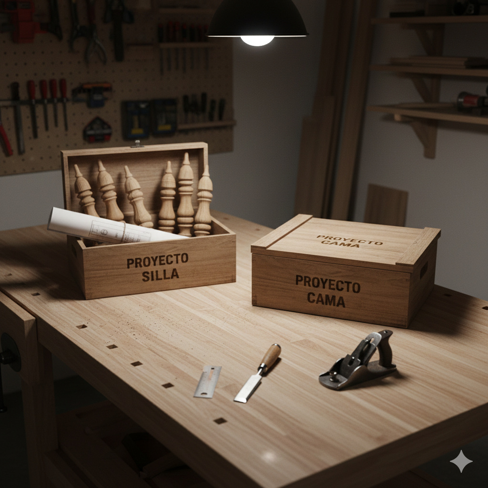

# Flujo de trabajo orientado a proyectos

```{r}
#| echo: false
source("_common.R")
```

Este capítulo se basa en [@bryan_what_2025, cap. 3, 5] y tiene como propósito introducir los elementos básicos para trabajar por proyectos en Positron para R. Exploraremos los siguientes aspectos:

1. ¿Qué significa organizar tu trabajo por proyectos?
2. ¿Cómo adoptar un flujo de trabajo por proyectos en Positron para R?
3. ¿Qué recomendaciones adoptar para nombrar archivos y carpetas para mantener un proyecto organizado?

## Organizar tu trabajo por proyectos

Imagina que eres un carpintero profesional y quieres construir una silla y una cama. Tienes 2 formas de trabajar (Ver @fig-1-chap-3):

**1. El taller del caos**

Trabajas con ambos proyectos mezclados sobre la misma mesa de trabajo. Las piezas de la silla están amontonadas sobre las de la cama y los tornillos están revueltos. Para avanzar en la silla, primero debes apartar lo que te estorba de la cama. Si decides mudarte de taller, tienes que identificar y recoger cada pieza una por una, con el riesgo de olvidar algo o llevarte una parte que no corresponde.

**2. El taller por proyectos**

Utilizas una caja independiente para cada mueble. Sobre la mesa de trabajo solo pones la caja de la silla o la de la cama, según lo que necesites. Cada caja contiene únicamente las piezas y los planos de ese proyecto. Si decides trabajar en la silla, la mesa queda libre de cualquier parte de la cama. Si tienes que mudarte de taller, simplemente cierras la caja y te la llevas: cada proyecto es autónomo, listo para continuar en cualquier otro lugar.

::: {#fig-1-chap-3 layout="[[48,-4,48]]"}
{fig-alt="Una mesa de trabajo de carpintería desordenada donde las piezas de madera de una silla y una cama están mezcladas y amontonadas, ilustrando la falta de un flujo de trabajo organizado."}

{fig-alt="Una mesa de trabajo de carpintería organizada donde las piezas de una silla y una cama están separadas en cajas independientes, ilustrando un flujo de trabajo basado en proyectos."}

Analogía para entender la importancia de adoptar un flujo de trabajo orientado a proyectos
:::

Cuando utilices R con Positron para realizar un análisis de datos, es importante adoptar un flujo de trabajo orientado a proyectos. Esto significa:

- **Establecer un orden y estructura**: consiste en que coloques todos los archivos relacionados con un mismo proyecto en una carpeta específica. Si el proyecto crece en complejidad, utiliza subcarpetas para mantener la claridad. Asimismo, adopta un sistema coherente para nombrar tanto tus carpetas como los archivos.

- **Saber dónde estás parado**: Al trabajar en un proyecto, Positron debe estar situado exactamente en la carpeta específica del proyecto. Esto se conoce como [directorio de trabajo](https://es.wikipedia.org/wiki/Directorio_de_trabajo). Si Positron intenta buscar tus archivos en el lugar equivocado, no podrá abrirlos. Lo ideal es que Positron se sitúe en la carpeta correcta al abrir tu proyecto.

- **Adoptar una disciplina de rutas**: todas las rutas de tus archivos deben ser en lo posible relativas. Esto significa que, como ya sabes dónde estás parado, solo necesitas indicar el camino desde la carpeta del proyecto hacia el archivo que quieres usar. De esta forma, evitas escribir rutas largas y fijas que solo funcionan en tu computador. 

Estas prácticas permiten que el proyecto sea portátil y comprensible. Al implementarlas, podrás mover la carpeta del proyecto de un lugar a otro en tu computador, e incluso enviarla a otras personas y que el proyecto simplemente "funcione" [@bryan_project-oriented_2017]. Además, permites que otra persona pueda explorar el proyecto y entender la estructura de tu trabajo.

::: {.callout-note}
En la @sec-project-oriented-workflow-positron-r abordaremos de manera práctica en Positron como se materializan los aspectos mencionados en ésta sección. Si algunos elementos no se entienden a profundidad con la generación de un proyecto de R en Positron quedarán más claros estos aspectos.
:::

## Flujo de trabajo por proyectos en Positron para R {#sec-project-oriented-workflow-positron-r}

En Positron, un proyecto es un conjunto de archivos que se encuentran en una carpeta específica así como un conjunto de configuraciones que se aplican por defecto para realizar una tarea determinada. Al abrir esta carpeta, Positron asume automáticamente que todo lo que necesitas buscar o guardar se encuentra dentro de ella. Organizar tu trabajo de esta manera permite la reproducibilidad, eficiencia, automatización y colaboración con otras personas.

Para generar un proyecto de R en Positron, utiliza la combinación de teclas  para desplegar la paleta de comandos y escribe: **Workspaces: New Folder from Template...**. Luego, podrás presionar esta opción y elegir a continuación **R project** para realizar las configuraciones respectivas de tu proyecto.

Primero, deberás definir el nombre de la carpeta donde estará tu proyecto y la ubicación dentro de tu computador o equipo. En el caso del nombre, para que sigas el contenido del libro te recomendamos utilizar `r-analisis-datos`. 

::: {.callout-note}
En la [@sec-how-to-name-files-folders] abarcaremos con más detalle la forma recomendada de nombrar archivos y carpetas adoptando un conjunto de principios, de modo que puedas mantener tu proyecto organizado. 
:::

Segundo, aunque es posible aplicar ajustes avanzados, te sugerimos mantener la configuración inicial lo más simple posible. Para el desarrollo de este libro, solo es necesario que selecciones la versión de R que utilizarás. Otras opciones como **Initialize Git repository** o **Use `renv` to create a reproducible environment** no las abarcaremos.

::: {.callout-note}
Si deseas profundizar en éstas opciones más adelante, cuando estes familiarizado con R y Positron, puedes consultar [@bryan_happy_2024] y la [documentación oficial](https://rstudio.github.io/renv/index.html) de `renv` 
:::

## ¿Cómo nombrar archivos y carpetas? {#sec-how-to-name-files-folders}

Existen 3 principios para nombrar archivos y carpetas [@bryan_what_2025, cap. 5]:

1. **Legible por máquinas:** los nombres deben estar optimizados para el procesamiento automatizado, basándose en 2 pilares.
   
   - **Compatibilidad con búsquedas y automatización**: un nombre debe prescindir de espacios en blanco, signos de puntuación (p. ej., `.`, `,`, `;`, `:`) a excepción del punto que precede a la extensión de un archivo (p. ej., `.html`, `.pdf`, `.docx`) y caractéres acentuados (p. ej., `á`, `ñ`, `ü`) así como usar preferiblemente minúsculas.

   - **Facilidad de cómputo**: es necesario utilizar de manera deliberada delimitadores como `_` o `-`, facilitando que el sistema operativo o R fragmente el nombre y recupere datos automáticamente. 

2. **Legible por humanos:** un nombre debe permitir deducir el contenido de un archivo o carpeta sin tener que abrirlo, basándose en 2 pilares.

   - **Nombres con carga informativa**: el nombre debe funcionar como un resumen del contenido mediante el uso de palabras claves.

   - **Semántica del slug**: este concepto proviene de las [URLs semánticas](https://es.wikipedia.org/wiki/URL_sem%C3%A1ntica), que reemplazan códigos ilegibles por palabras que explican la jerarquía y el tema de una página (p. ej., `dominio.com/cursos/r-basico` en lugar de `dominio.com/?id=123`). Al aplicar esta lógica a tus archivos, transformas un nombre genérico en una ruta con significado (p. ej., `001_limpieza-datos.R` en lugar de `documento_v1.R` donde el primero comunica qué contiene y en qué etapa del proyecto se encuentra). 

3. **Compatible con el ordenamiento por defecto:** un nombre debe permitir que aparezca en la secuencia lógica deseada de forma automática, basándose en 3 pilares.

   - **Priorizar el uso de números al inicio:** colocar un identificador numérico al comienzo del nombre garantiza que los archivos o carpetas se listen siguiendo una jerarquía del proyecto, en lugar de un orden alfabético aleatorio.

   - **Utilizar el estándar [ISO 8601](https://en.wikipedia.org/wiki/ISO_8601) para fechas:** si el nombre incluye fechas utilizar el formato **AAAA-MM-DD** (Año-Mes-Día).

   - **Rellenar números con ceros a la izquierda:** para mantener el orden se deben usar ceros (p. ej., `000`, `001`,  `002`, ... , `010`, ...) en lugar de números simples (`0`, `1`, `2`, ... , `10`, ...). Sin los ceros iniciales, un sistema operativo situará el `10` inmediatamente después del `1`, rompiendo la secuencia lógica.

::: {.callout-tip}
¿Cuándo usar guión bajo (`_`) vs guión medio (`-`) para nombrar archivos y carpetas?

Para que tus archivos sean fáciles de fragmentar por R o el sistema operativo, utiliza esta regla sencilla:

- **Guion bajo (`_`) para separar "metadatos"**: Úsalo para dividir bloques de información distinta, como el número de orden del tema.
- **Guion medio (`-`) para separar palabras**: Úsalo para unir palabras que pertenecen a un mismo concepto o sección.

Por ejemplo, en `001_limpieza-datos.R` el `_` separa el orden (`001`) del tema (`limpieza-datos`). El `-` simplemente une las palabras `limpieza` y `datos` para que se lean como una sola idea.
:::

