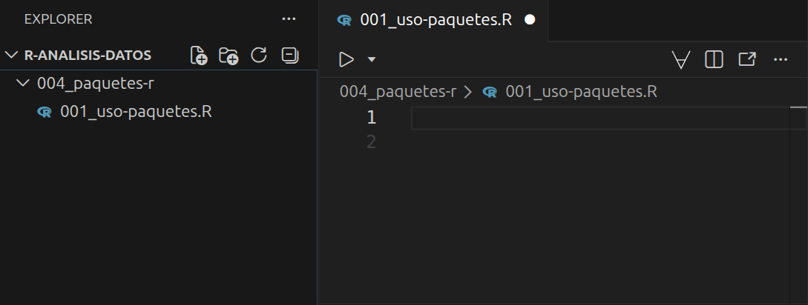
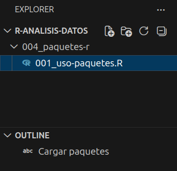

# Paquetes de R

```{r}
#| echo: false
source("_common.R")
```

Este capítulo se basa en [@ismay_statistical_2025, cap. 1] y tiene como propósito introducir el concepto de paquetes de R. Exploraremos los siguientes aspectos:

1. ¿Qué son los paquetes en R?
2. ¿Cómo instalar paquetes?
3. ¿Cómo cargar paquetes?
4. Una demostración de cómo utilizar un paquete

## ¿Qué son los paquetes en R? {#sec-what-are-r-packages}

En R un paquete, en términos simples, es una carpeta organizada de cierta forma que alguién más creó que te brinda herramientas listas para usar con el objetivo de realizar una tarea específica o extender la funcionalidad base de R. De hecho, cuando instalas R por primera vez, este ya viene con un grupo de paquetes estandar (o de base) por defecto que le permiten funcionar y realizar ciertas tareas. Independientemente de si un paquete esta incluido en R por defecto o tiene como proposito extender su funcionalidad, su estructura siempre consta de 3 elementos [@wickham_r_2023-1]:

- **Funciones**: son instrucciones predefinidas que reciben una información, la procesan y entregan un resultado para realizar una tarea específica de manera automática.

- **Documentación**: es la guía que explica que hace cada función, que requiere para funcionar y que resultado genera.

- **Datos de muestra**: son conjuntos de datos para ilustrar el funcionamiento de las funciones.

Para entender cómo funcionan los paquetes en R se puede utilizar una analogía con las aplicaciones de un celular [@ismay_statistical_2025, cap. 1]. Cuando compras un celular nuevo, este viene por defecto con aplicaciones para que se pueda utilizar. Sin embargo, de acuerdo a las necesidades de cada usuario se instalan otras aplicaciones adicionales para extender la funcionalidad del celular de tal manera que se cubran los requerimientos que cada individuo necesita (Ver @fig-1-chap-4).

::: {#fig-1-chap-4 layout="[[48,-4,48]]"}
{fig-alt="Ilustración de un celular con aplicaciones básicas como calculadora y calendario, representando los paquetes que R incluye por defecto."}

{fig-alt="Interfaz de una tienda de aplicaciones digitales con diversos íconos de herramientas especializadas, simbolizando paquetes no instalados por defecto en R que extienden su funcionalidad base."}

Analogía para entender la diferencia entre paquetes que vienen incorporados por defecto en R y aquellos que se pueden instalar para extender su funcionalidad base
:::

## Instalación de paquetes

Para instalar un paquete que no vienen por defecto en R, retomaremos la analogía de la @sec-what-are-r-packages. En un celular, primero es necesario descargar la aplicación de una tienda una sola vez. Luego, basta con abrirla cada vez que se requiera. Aunque ocasionalmente deba actualizarse, no es necesario reinstalarla nuevamente.

En R, el proceso es semejante. Primero instalas el paquete desde un repositorio (equivalente a la tienda de aplicaciones) y luego lo cargas, un paso análogo a abrir la aplicación en tu celular.

Para practicar este proceso, instalaremos el paquete [`tidyverse`](https://tidyverse.org/). Este paquete es una colección de herramientas diseñadas para ciencia de datos que utilizaremos constantemente a lo largo del libro. Para iniciar la instalación, ubica la pestaña **Console** en el **Panel** (Ver la @fig-positron-layout-outline) y, tras el símbolo `>`, escribe el siguiente comando:

```r
install.packages("tidyverse")
```

Luego, presiona . Ten paciencia hasta que el proceso finalice y no te preocupes por los mensajes que aparezcan en la consola. Al ser un conjunto robusto de herramientas, la instalación puede tardar. Sabrás que ha terminado el proceso cuando veas aparecer nuevamente el símbolo `>`.

::: {.callout-important}
Al instalar un paquete en R, asegúrate de escribir su nombre entre comillas (`""`). De lo contrario, la instalación fallará. Por ahora, no te preocupes por la razón detrás de éste aspecto. Lo importante es que te asegures que puedas saber cómo instalar un paquete en R.
:::

## Carga de paquetes

Cuando instalas una aplicación en tu celular es necesario abrirla para poder usarla, no basta con simplemente instalarla. En R para poder utilizar un paquete que se encuentre instalado previamente es necesario cargarlo (equivalente a abrir una aplicación que se encuentra instalada en un celular). En R para cargar un paquete se utiliza la función `library()`.

Por ejemplo, si deseas cargar el paquete `tidyverse` escribe el siguiente comando en la consola:

```r
library(tidyverse)
```

Luego, presiona . Si el paquete `tidyverse` fue instalado de manera correcta se generará un texto (ver el @lst-load-tidyverse-message) igual o similar al que se muestra a continuación en la consola:

::: {#lst-load-tidyverse-message}

```r
── Attaching core tidyverse packages ── tidyverse 2.0.0 ──
✔ dplyr     1.2.0     ✔ readr     2.2.0
✔ forcats   1.0.1     ✔ stringr   1.6.0
✔ ggplot2   4.0.2     ✔ tibble    3.3.1
✔ lubridate 1.9.5     ✔ tidyr     1.3.2
✔ purrr     1.2.1     
── Conflicts ──────────────────── tidyverse_conflicts() ──
✖ dplyr::filter() masks stats::filter()
✖ dplyr::lag()    masks stats::lag()
ℹ Use the conflicted package to force all conflicts 
 to become errors
```
:::

::: {.callout-note}
En el @sec-how-do-i-code-in-r podrás explorar más acerca de los tipos de texto que la consola puede generar y cómo interpretarlos cuando se genere algún contenido. Allí explicaremos en particular el texto del @lst-load-tidyverse-message. 
:::

## Uso de paquetes

Para entender cómo utilizar un paquete, explorarás tu primer conjuntos de datos en R utilizando el paquete `tidyverse`. Primero, cierra la ventana de Positron si seguiste las instrucciones descritas en la @sec-how-to-install-r-positron y abre la carpeta `r-analisis-datos` (Ver @sec-project-oriented-workflow-positron-r) utilizando las opciones **File > Open Folder...** que podrás encontrar en el menú superior izquierdo de la interfaz. En caso que estes utilizando Posit Workbench (Ver @sec-posit-workbench) abre una sesión con el proyecto `r-analisis-datos`, creado de acuerdo a lo señalado en la @sec-project-oriented-workflow-positron-r.

Luego, en la **Barra de actividades** (ver @fig-positron-layout-outline) selecciona el ícono {fig-alt="Ícono del explorador de archivos" height=25} y párate con el puntero del ratón en la **Barra lateral primaria** (ver @fig-positron-layout-outline) donde al lado izquierdo de la etiqueta `R-ANALISIS-DATOS` podrás encontrar en el segundo ícono de izquierda a derecha la opción de crear una carpeta. Crea la carpeta con el nombre `004_paquetes-r` y dentro de la carpeta también en la **Barra lateral primaria** utiliza el primer ícono de izquierda a derecha para crear un archivo con el nombre `001_uso-paquetes.R`. De esa manera podras abrirlo en el **Editor** (ver @fig-positron-layout-outline) tal como se muestra en la @fig-2-chap-4: 

{#fig-2-chap-4 fig-alt="Captura de pantalla de Positron que muestra la carpeta 004_paquetes-r dentro del proyecto R-ANALISIS-DATOS, conteniendo el archivo 001_uso-paquetes.R abierto en el editor"}

En el archivo `001_uso-paquetes.R` carga el paquete `tidyverse` escribiendo el contenido que se menciona a continuación. Para que R procese la instrucción, sitúa el cursor (`|`) sobre la línea de código y presiona la combinación de teclas :

```{r}
#| message: false
#| lst-label: lst-load-tidyverse
#| lst-cap: Línea de código para cargar el paquete tidyverse
# Cargar librerias ----
library(tidyverse)
```

::: {#nte-execute-code .callout-note}
Cada vez que requieras ver el resultado de una línea de código que se encuentra dentro de un archivo con extensión `.R` sitúa el cursor (`|`) sobre la línea de código y presiona la combinación de teclas . De ahora en adelante nos referimos a éste proceso como **ejecutar el código**. 
:::

En el @lst-load-tidyverse el símbolo `#` permite agregar comentarios para entender los comandos que escribimos y `----` genera secciones para mantener organizado el contenido dentro de un archivo con extensión `.R` donde las señala en la **Barra lateral primaria** en la sección **OUTLINE** (Ver @fig-3-chap-4) en Positron. 

Un archivo con extensión `.R` por si sólo no genera ningún resultado. Por ello, debes utilizar la combinación de teclas mencionada anteriormente para ejecutar los comandos en el **Editor** y mostrar el resultado señalado en el @lst-load-tidyverse-message en el **Panel** (ver @fig-positron-layout-outline) dentro de la pestaña **CONSOLE**.

{#fig-3-chap-4 fig-alt="Vista de la barra lateral primaria de Positron donde se observa la sección OUTLINE mostrando la etiqueta 'Cargar librerías', la cual se genera automáticamente a partir de los guiones en en el archivo '001_uso-paquetes.R'"}

Una vez cargado el paquete `tidyverse` puedes explorar el conjunto de datos `mpg` que contiene información de economía de combustible desde 1999 hasta 2008 para 38 modelos populares de automóviles. Agrega al archivo `001_uso-paquetes.R` el siguiente contenido y ejecuta el código (Ver @nte-execute-code) para que puedas visualizar parte de los datos en la consola donde el resultado puede variar dependiendo del tamaño de la pantalla de tu equipo:

```{r}
#| lst-label: lst-mpg-database
#| lst-cap: Conjunto de datos `mpg`
# Explorar el conjunto de datos mpg ----
mpg
```

En el resultado del @lst-mpg-database se incluye información para entender aspectos del conjunto de datos `mpg`:

- `# A tibble: 234 × 11` indica en primera instancia el tipo de objeto en R denominado [`tibble`](https://tibble.tidyverse.org/articles/tibble.html) donde se compone de `234` filas y `11` columnas.

- Una `tibble` solo muestra la cantidad de columnas que caben en tu pantalla. Por ese motivo se señalan en la parte superior los nombres de las columnas `manufacturer`, `model`, `displ`, `year`, `cyl`, `trans`, `drv`, `cty` y luego en la parte inferior las variables restantes `hwy`, `fl` y `class` en el mensaje `# ℹ 3 more variables: hwy <int>, fl <chr>, class <chr>`.

- Debajo de los nombres de las columnas se indica el tipo de dato que corresponde a cada variable (p. ej., `<chr>`, `<dbl>`, `<int>`). En caso que no se puedan mostrar todas las columnas en la pantalla, en la parte inferior se señalan los tipos restantes de las demás columnas. Las diferentes opciones de tipos de columnas se pueden consultar en la documentación oficial del paquete `tibble`, que hace parte del paquete `tidyverse`, en [Column types](https://tibble.tidyverse.org/articles/types.html).

- Por defecto una `tibble` solo muestra las primeras 10 filas pero señala en la parte inferior con el mensaje `# ℹ 224 more rows` el número de filas restantes que componen el conjunto de datos.

Si el conjunto de datosß pertenece a un paquete, como en el caso de `mpg`, es posible consultar documentación acerca de la misma utilizando el símbolo `?` más su nombre tal como se muestra a continuación:

```{r}
#| eval: false
# Documentación del conjunto de datos mpg ----
?mpg
```

Si ejecutas éste código, en la **Barra lateral secundaria** dentro de la pestaña **HELP** se desplegará la documentación relacionada con `mpg`.

En Positron también se puede utilizar una herramienta denominada [Explorador de Datos](https://positron.posit.co/data-explorer.html) para visualizar la información en una cuadrícula similar a una hoja de cálculo, así como filtar y ordenar los datos temporalmente y obtener estadísticas de cada variable. Para utilizar ésta herramienta ejecuta el siguiente código:

```{r}
#| eval: false
# Uso del explorador de datos ----
View(mpg)
```

De esa manera podrás utilizar el explorador de datos y examinar los elementos indicados anteriormente para `mpg` tal como se muestra en la @fig-4-chap-4.

{#fig-4-chap-4 fig-alt="Interfaz del Explorador de Datos en Positron mostrando el conjunto de datos mpg. A la izquierda se observa un panel con la lista de variables e histogramas de distribución para cada variable. A la derecha, una cuadrícula interactiva con los datos de los vehículos organizados en filas y columnas."}

En ocasiones se hace necesario poder dar un "vistazo" a un conjunto de datos cuando se tiene un número considerable de columnas. En ese sentido, otra forma adicional de explorar un conjunto de datos, es mediante el uso de la función `glimpse()`. Esta función permite visualizar los nombres de las columnas verticalmente hacia abajo y los datos correspondientes a cada varaible de manera horizontal. Para utilizar ésta herramienta ejecuta el siguiente código:

```{r}
# "Vistazo" del conjunto de datos ----
glimpse(mpg)
```

De esa manera tal como se muestra anteriormente es posible visualizar en su totalidad los nombres de las columnas sin importar el ancho de la pantalla de tu equipo, así como el tipo de cada columna y una parte de los datos asociados a cada variable. Este aspecto es útil, particularmente cuando se tiene un conjunto de datos con una cantidad considerable de columnas.

Por último, en ciertos contextos puede ser útil extrar y explorar sólo una variable dentro de un conjunto de datos. En R existen diversas formas de lograr esto. Sin embargo, señalaremos sólo 2 alternativas, enfocándonos en el uso del operador `$`, que está incluído por defecto en R, y la función `pull()` del paquete `dplyr`, que hace parte del paquete `tidyverse`. Explora las 2 alternativas, agregando el contenido señalado a continuación en tu archivo `001_uso-paquetes.R` para que al ejecutar el código puedas ver los resultados equivalentes que se generan en la consola.  

Si se buscara, por ejemplo, extraer la variable `manufacturer` de `mpg` con el operador `$` puedes ejecutar el siguiente código:

```{r}
#| eval: false
# Extracción de columnas ----
mpg$manufacturer
```

De manera alternativa puedes utilizar la función `pull()` del paquete `dplyr`, ejecutando el siguiente código:

```{r}
#| eval: false
pull(mpg, manufacturer)
```