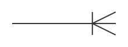
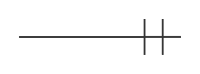
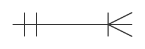
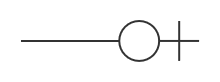

# Verbos de dos tablas {#sec-two-table-verbs}

```{r}
#| echo: false
source("_common.R")
```

```{r}
#| label: load-r-packages
#| echo: false
#| message: false
```

Este capítulo se basa en [@wickham_r_2023, Cap. 19] así como en la documentación oficial de [`dplyr`]() donde tiene como propósito introducir a través de la **gramática de manipulación de datos** un marco flexible para conectar o unir tablas de datos utilizando el paquete `dplyr` e información de los resultados del examen Saber Pro del grupo de competencias genéricas correspondientes al periodo 2021-2024 para Colombia.

Exploraremos los siguientes aspectos:

1. ¿Cómo entender la relación entre diferentes tablas de datos a través de un Diagrama Entidad-Relación (Entity-Relationship Diagram (ERD) en inglés)?
2. ¿Cómo interpretar las relaciones en un Diagrama Entidad-Relación utilizando la notación **Crow's Foot** ("pata de cuervo" en español)?  
3. ¿Cuáles son los tipos de verbos de dos tablas?
4. ¿Cómo combinar variables de múltiples tablas utilizando **Mutating Joins** ("uniones de transformación" en español)?

:::: {#nte-1-chap-11 .callout-note}
Para desarrollar el contenido de este capítulo es necesario que descargues los archivos señalados a continuación y los incluyas dentro de la carpeta `data`, respecto a lo descrito en la @nte-1-chap-6:
   
::: {.callout appearance="minimal"}
## {fig-alt="Ícono del explorador de archivos" height=25} [resultados-saber-pro.rds]()
:::

::: {.callout appearance="minimal"}
## {fig-alt="Ícono del explorador de archivos" height=25} [divipola-departamentos.rds]()
:::

::: {.callout appearance="minimal"}
## {fig-alt="Ícono del explorador de archivos" height=25} [divipola-municipios.rds]()
:::

::: {.callout appearance="minimal"}
## {fig-alt="Ícono del explorador de archivos" height=25} [programas-pregrado-faedis.rds]()
:::

En caso que hayas seguido estas indicaciones, procede a crear una nueva carpeta llamada `011_verbos-dos-tablas-en-r` y dentro de ella genera el archivo `001_manipular-datos-dos-tabla.R`, siguiendo las pautas de la @sec-package-usage.
::::

## Diagrama Entidad-Relación

Al realizar un análisis de datos es habitual tener que combinar dos o más tablas, una necesidad que surge principalmente del diseño propio de las bases de datos relacionales. Aunque no se profundizará en cómo crearlas o conectarse a ellas (ver @nte-2-chap-11), es conveniente conocer una representación gráfica que permita visualizar un conjunto de tablas de datos y las posibles relaciones que existen entre ellas para entender cómo se puede consolidar un determinado conjunto de información que se requiere para llevar a cabo un determinado análisis.

::: {#nte-2-chap-11 .callout-note}
En el tidyverse existe el paquete [`dbplyr`]() que junto al paquete [DBI]() permite interactuar con bases de datos en R usando la sintaxis de `dplyr`. Así como, consultar y transformar tablas dentro de ellas sin necesidad de escribir código SQL directamente, ya que `dbplyr` traduce la sintaxis de `dplyr` a consultas en lenguaje SQL.

En ese sentido, cuando estés familiarizado con los verbos de dos tablas puedes explorar este paquete si requieres conectarte más adelante a una base de datos relacional para realizar un análisis utilizando lo aprendido acerca de `dplyr`. 
:::

Una representación gráfica que cumple con este propósito es un Diagrama de Entidad-Relación que ilustra cómo una base de datos relacional compuesta por un conjunto de tablas se relacionan entre sí. Estos diagramas se componen de 3 elementos:

1. **Entidades**: representan cualquier objeto, concepto o evento.
2. **Atributos**: son las características, rasgos o propiedades de cada entidad.
3. **Relaciones**: es la asociación o vínculo lógico que existe entre dos o más entidades.

En la @fig-erd se indica un posible Diagrama de Entidad-Relación utilizando como insumo el conjunto de datos señalado en la @nte-1-chap-6 y que se utilizó en la parte de visualización de datos para analizar los resultados del examen Saber Pro del grupo de competencias genéricas correspondientes a programas de pregrado de FAEDIS de la UMNG así como información adicional proveniente de los archivos señalados en la @nte-1-chap-11.  

{#fig-erd fig-alt="Diagrama Entidad-Relación con notación Crow's Foot que modela cuatro tablas: «Resultado Saber-Pro» en el centro (con claves primarias Año e ID estudiante, datos demográficos, puntajes y claves foráneas hacia departamento, municipio y programa), «Programa académico» a la izquierda (PK: ID Programa académico), «Departamento» arriba a la derecha (PK: ID Departamento) y «Municipio» abajo a la derecha (PK: ID Municipio y FK: ID Departamento). Las líneas conectan a Resultado Saber-Pro con las demás tablas mediante sus claves foráneas, y a Departamento con Municipio en una relación de uno a muchos. En la parte inferior, una leyenda describe las siglas PK (Clave primaria) y FK (Clave foránea), junto a los símbolos de cardinalidad: Cero o uno, Uno y solo uno, Uno o muchos, y Cero o muchos."}

## Entidades

En la @fig-erd se señalan 4 entidades para representar una base de datos relacional que tenga como objetivo almacenar información relacionada con los resultados del examen Saber Pro de competencias genéricas en programas de pregrado de FAEDIS:

a. **Resultado Saber-Pro**: corresponde a un evento donde modela la acción de un estudiante presentando las pruebas Saber-Pro en un periodo y lugar específico junto con sus características socioeconómicas y los resultados obtenidos.

b. **Programa académico**: representa los programas académicos de pregrado de FAEDIS a los cuales puede potencialmente pertenecer un estudiante.

c. **Departamento**: representa la división político-administrativa a nivel departamental para Colombia según la codificación DIVIPOLA donde permite enriquecer los resultados obtenidos en la prueba Saber-Pro con información geográfica a nivel departamental.

d. **Municipio**: representa la división político-administrativa a nivel municipal para Colombia según la codificación DIVIPOLA donde permite enriquecer los resultados obtenidos en la prueba Saber-Pro con información geográfica a nivel municipal.

::: {#nte-3-chap-11 .callout-note}
A un elemento específico y concreto de una entidad se le denomina **instancia**. Por ejemplo, respecto a la @fig-erd *Amazonas* es una instancia de la entidad **Departamento**.
:::

## Atributos

Cada entidad en la @fig-erd se puede describir a través de características, rasgos o propiedades que se recopilan en una variable y se almacenan en una columna dentro de una tabla. Por ejemplo, la entidad **Departamento** se describe a través de las variables `ID Departamento` que identifica de manera única a cada instancia, `Nombre` que corresponde a su denominación oficial y `Latitud` junto con `Longitud` que brindan información sobre su ubicación geográfica.

### Clave primaria

Dentro de los atributos se define una clave primaria (Primary Key (**PK**) en inglés) que tiene como propósito identificar de forma única cada registro dentro de una tabla. Es decir, no pueden existir dos filas con el mismo valor de la clave primaria. Adicionalmente una clave primaria debe cumplir con un conjunto de reglas fundamentales:

a. **Unicidad**: cada valor debe ser único en cada tabla
b. **No nulidad**: no puede contener valores vacíos o ausentes (`NA` o `NULL` en R). Es decir, todo registro debe estar asociado a una entidad.
c. **Inmutabilidad**: Su valor no debe cambiar con el tiempo.

Por otro lado, una clave primaria puede estar formada por una sola columna dentro de una tabla pero también se puede formar uniendo dos o más columnas cuando una sola no basta para garantizar unicidad. En el caso de la @fig-erd respecto a la entidad **Resultado Saber-Pro** se utilizan las variables `Año` y `ID estudiante` para identificar de manera única el evento relacionado con la acción de un estudiante presentando las pruebas Saber-Pro en un periodo determinado. Aunque también se puede utilizar una columna como en el caso de la entidad **Departamento** en la @fig-erd donde se hace uso de la variable `ID Departamento` para identificar de manera única esta entidad utilizando la codificación DIVIPOLA.

### Clave foránea

Un atributo presente en una tabla cuyos valores hacen referencia directa a la clave primaria de otra tabla se conoce como clave foránea (Foreign Key (**FK**) en inglés). Este atributo es el puente que permite establecer una relación entre dos entidades así como vincular datos sin necesidad de duplicar toda la información. Por ejemplo, en lugar de repetir en la tabla relacionada con la entidad **Resultado Saber-Pro** el nombre del departamento así como su latitud y longitud, solo es necesario incluir la variable `ID Departamento` sin necesidad de repetir los demás atributos de la entidad **Departamento**.

A diferencia de una clave primaria (**PK**), los valores de una clave foránea (**FK**) se pueden repetir en una tabla. Por ejemplo, diferentes instancias de la entidad **Resultado Saber-Pro** pueden tener una misma `ID Departamento` porque muchos estudiantes pueden presentar el Saber-Pro en un mismo departamento. Adicionalmente, una clave foránea (**FK**) puede contener valores vacíos o ausentes. Por ejemplo, si un estudiante presenta el Saber-Pro en el exterior se esperaría que no tenga asociado un `ID Departamento` porque el lugar donde lo presentó no se encuentra dentro del territorio colombiano (ver @wrn-1-chap-11).

::: {#wrn-1-chap-11 .callout-warning}
En la @sec-case-study-mutating-joins utilizando `resultados-saber-pro.rds` respecto a los archivos señalados en @nte-1-chap-11 se ajustará este aspecto debido a que la fuente donde se obtuvieron los datos (Data Icfes), utiliza por defecto a Bogotá como departamento de presentación del examen cuando se presenta la prueba Saber Pro en el exterior. También ocurre un comportamiento similar en este contexto para el caso de `ID Municipio`. Con los ajustes respectivos que aplicarás en la @sec-case-study-mutating-joins, es posible generar de manera consistente las tablas de las entidades `Departamento` y `Municipio` para que reflejen lo señalado en la @fig-erd. 
:::

## Relaciones {#sec-relaciones}

Las relaciones definen cómo se vinculan lógicamente 2 entidades a través de las claves primarias (**PK**) y foráneas (**FK**) donde se utiliza el concepto de **cardinalidad**. La cardinalidad define las restricciones numéricas que gobiernan el vínculo lógico entre 2 entidades. En términos sencillos, la cardinalidad responde a la pregunta

> ¿Con cuántas instancias de una entidad `A` se puede vincular una instancia de la entidad `B`?

Para definir este aspecto, la cardinalidad se descompone en dos límites: mínimo y máximo. Por un lado, la cardinalidad mínima indica si la relación debería ser obligatoria u opcional:

- `0` (opcional): una instancia de una entidad puede existir sin estar asociada a ninguna instancia de otra entidad
- `1` (obligatoria): una instancia de una entidad debe estar asociada obligatoriamente a al menos una instancia de otra entidad

Por ejemplo, respecto al contexto de FAEDIS en la UMNG con base en la @fig-erd un estudiante que presenta la prueba en un determinado periodo debe estar asociado a un programa académico. De lo contrario, si el estudiante realiza por su lado la prueba sin inscribirse a través de la universidad no se tienen en cuenta los resultados obtenidos para analizar el desempeño de FAEDIS. Es decir, la relación de la entidad **Resultados Saber-Pro** hacia la entidad **Programa académico** respecto a la cardinalidad mínima implica que una instancia de la primera está asociada obligatoriamente con al menos una instancia de la segunda entidad.

En el otro sentido, un programa académico de FAEDIS no necesariamente está asociado con un estudiante que presenta la prueba del Saber-Pro en un determinado periodo dado que pueden existir programas académicos que se encuentran inactivos y no se tienen en cuenta en los resultados obtenidos para analizar el desempeño de FAEDIS. Es decir, la relación de la entidad **Programa académico** hacia la entidad **Resultados Saber-Pro** respecto a la cardinalidad mínima implica que una instancia de la primera no necesariamente está asociada con al menos una instancia de la segunda entidad.

Por otro lado, la cardinalidad máxima indica el número "tope" de instancias con las que se debería vincular:

- `1` (uno): como máximo una instancia de una entidad está asociada con una sola instancia de otra entidad
- `N` (muchos): una instancia de una entidad se puede vincular con varias instancias de otra entidad

Por ejemplo, respecto al contexto de FAEDIS en la UMNG con base en la @fig-erd un estudiante que presenta la prueba en un determinado periodo debe estar asociado a lo más con un programa académico. En el caso en que un estudiante realice dos o más programas académicos y presente la prueba dentro de los registros de DATA ICFES respecto a `resultados-saber-pro.rds`, se consideran como dos o más instancias diferentes dentro de **Resultados Saber-Pro**. Es decir, la relación de la entidad **Resultados Saber-Pro** hacia la entidad **Programa académico** respecto a la cardinalidad máxima implica que una instancia de la primera está asociada a lo más con una instancia de la segunda entidad.

En el otro sentido, un programa académico de FAEDIS puede estar asociado con muchos estudiantes que presentan la prueba del Saber-Pro en un determinado periodo porque muchos estudiantes pertenecientes a un mismo programa académico presentan la prueba en un mismo año. Es decir, la relación de la entidad **Programa académico** hacia la entidad **Resultados Saber-Pro** respecto a la cardinalidad máxima implica que una instancia de la primera está asociada con muchas instancias de la segunda entidad.

### Notación Crow's Foot

Respecto a los elementos señalados en la @sec-relaciones existen diferentes tipos de notación para representar de manera gráfica la cardinalidad de las relaciones y los vínculos que existen entre entidades a través de las claves primarias y foráneas. En la @fig-erd se utiliza la notación **Crow's foot** para representar los vínculos entre las entidades así como su cardinalidad tanto mínima como máxima donde en la @tbl-symbols-crow-foot-notation se señalan los símbolos utilizados por esta notación y en la @tbl-relation-cardinality-crow-foot-notation la representación gráfica de la cardinalidad.

A modo de ejemplo, la cardinalidad de la relación de la entidad **Departamento** hacia la entidad **Municipio** así como la cardinalidad de la relación de la entidad **Municipio** hacia la entidad **Departamento** se puede representar de manera compacta a través de la unión de {fig-alt="Cardinalidad uno o muchos en notación crow's foot" height=25} y de {fig-alt="Cardinalidad uno y solo uno en notación crow's foot" height=25} como {fig-alt="Unión cardinalidad uno o muchos y uno y solo uno en notación crow's foot" height=25}, tal como se señala en la @fig-erd. Es decir, en el contexto de la codificación DIVIPOLA un departamento está vinculado con al menos un municipio y a lo más con muchos municipios pero un municipio está vinculado con uno y solo un departamento.

| Símbolo | Representación gráfica|
|:---|:---:|
| `0` (cero) | {fig-alt="Símbolo cero en notación crow's foot" height=50} |
| `1` (uno) | {fig-alt="Símbolo uno en notación crow's foot" height=50} |
| `N` (muchos) | {fig-alt="Símbolo muchos en notación crow's foot" height=50} |

: Símbolos en la notación Crow's Foot {#tbl-symbols-crow-foot-notation}

| Cardinalidad | Representación gráfica|
|:---|:---:|
| `0` o `1` (mínimo cero, máximo uno) | {fig-alt="Cardinalidad cero o uno en notación crow's foot" height=50} |
| `0` o `N` (mínimo cero, máximo muchos) | {fig-alt="Cardinalidad cero o muchos en notación crow's foot" height=50} |
| `1` y solo `1` (mínimo uno, máximo uno) | {fig-alt="Cardinalidad uno y solo uno en notación crow's foot" height=50} |
| `1` o `N` (mínimo uno, máximo muchos) | {fig-alt="Cardinalidad uno o muchos en notación crow's foot" height=50} |

: Cardinalidad de una relación y representación gráfica usando la notación Crow's Foot {#tbl-relation-cardinality-crow-foot-notation}

## Verbos {#sec-verbs-two-tables}

En el paquete `dplyr`, para manipular, conectar o unir 2 tablas de datos correspondientes a 2 entidades utilizando claves primarias y foráneas, existen 3 tipos de verbos:

1. **Mutating joins** (uniones de transformación en español): permiten combinar variables de diferentes tablas correspondientes a 2 entidades. En la @sec-mutating-joins utilizarás este tipo de verbos junto con el esquema de la @fig-erd y los archivos señalados en la @nte-1-chap-11 para reconstruir el archivo `2021-2024_saber-pro-genericas_faedis.rds` pero teniendo en cuenta la @wrn-1-chap-11.
2. **Filtering joins** (uniones de filtrado en español): buscan coincidencias entre registros de forma similar a las **Mutating joins**, pero afectan a las observaciones y no a las variables.
3. **Set operations** (operaciones de conjuntos): esperan que ambas tablas compartan exactamente las mismas variables y tratan sus observaciones como conjuntos matemáticos mediante funciones como `intersect()`, `union()` y `setdiff()`.

Debido a que las **Set operations** no se requieren para los análisis que desarrollaremos a lo largo del libro, no se profundizará en ellas en los siguientes apartados. No obstante, el lector interesado puede consultar la [documentación oficial]() de `dplyr` para conocer más detalles sobre este tipo de operaciones.

### Filtering joins {#sec-filtering-joins}

Existen dos tipos de **Filtering joins**:

i. **Semi joins**: mantiene todas las observaciones de la tabla de una entidad que tienen una coincidencia en la tabla de otra entidad.
ii. **Anti joins**: descarta todas las observaciones de la tabla de una entidad que tienen una coincidencia en la tabla de otra entidad.

Para ilustrar un ejemplo concreto utilizarás los archivos `divipola-departamentos.rds` y `resultados-saber-pro.rds` que corresponden a las tablas de las entidades **Departamento** y **Resultado Saber-Pro** en la @fig-erd, tal como se señala a continuación:

```{r}
#| message: false

# Cargar paquetes ----
library(tidyverse)

# Importar datos ----
divipola_departamentos <- read_rds(
  file = "data/divipola-departamentos.rds"
)

resultado_saber_pro <- read_rds(
  file = "data/resultados-saber-pro.rds"
)
```

Una vez importes las tablas, podrás darle un "vistazo" a cada una de ellas, tal como se señala a continuación:

```{r}
# Inspeccionar datos ----
divipola_departamentos |>
  glimpse()
```

```{r}
resultado_saber_pro |>
  glimpse()
```

Para utilizar los verbos de 2 tablas de `dplyr`, una vez importadas las tablas, es necesario entender a qué se refieren cada una de las variables que las componen. En ese sentido, a continuación se describen cada una de las variables en `divipola-departamentos.rds`:

1. **codigo**: código único asociado a cada departamento de acuerdo con la codificación DIVIPOLA donde Colombia se compone de 32 departamentos y adicionalmente para fines estadísticos se codifica como departamento el Distrito Capital de Bogotá.
2. **nombre**: nombre oficial del departamento de acuerdo con la codificación DIVIPOLA. 
3. **latitud**: coordenada geográfica en grados decimales que mide la distancia respecto a la línea ecuatorial, indicando la posición norte-sur del punto representativo de cada departamento.
4. **longitud**: coordenada geográfica en grados decimales que mide la distancia respecto al meridiano de Greenwich, indicando la posición este-oeste del punto representativo de cada departamento.

Respecto a las variables en `resultados-saber-pro.rds` estas corresponden a las señaladas en la @sec-variable-description pero donde se excluyen `estu_depto_presentacion`, `estu_mcpio_presentacion` y `estu_prgm_academico` debido a que de acuerdo a la @fig-erd son atributos que pertenecen a otras entidades.  

Teniendo claridad sobre el significado de las variables de cada entidad, es posible identificar cuáles departamentos de `divipola_departamentos` registran al menos una presentación del examen en `resultado_saber_pro`. Para lograr esto, se vincula la clave primaria `codigo` de la primera tabla con la clave foránea `estu_cod_depto_presentacion` de la segunda mediante la función `semi_join()`, tal como se señala a continuación:

```{r}
#| lst-label: lst-semi-join
#| lst-cap: Uso de la función `semi_join(x, y)` para filtrar las observaciones de `x` que coinciden con `y`

semi_join(
  x = divipola_departamentos,
  y = resultado_saber_pro,
  by = join_by(codigo == estu_cod_depto_presentacion)
)
```

En el @lst-semi-join se conservan únicamente las filas de `divipola_departamentos` (tabla asignada al parámetro `x`) que tienen al menos una coincidencia en `resultado_saber_pro` (tabla asignada al parámetro `y`). Es importante destacar que la función `semi_join()` es una **Filtering join**. En ese sentido, no añade nuevas columnas de la tabla `y` ni duplica filas de `x` cuando existen múltiples coincidencias por departamento, sino que únicamente filtra las observaciones de `x`.

Para conectar ambas tablas, el parámetro `by` se utiliza para indicar las claves que establecen la relación entre ellas. En este caso, a través de la función auxiliar `join_by()` como argumento de `by`, se señala qué clave de la primera tabla se relaciona con la clave de la segunda mediante la expresión `codigo == estu_cod_depto_presentacion` utilizando el operador relacional de igualdad `==` (ver @tbl-relational-operators), dado que las claves tienen nombres diferentes en cada tabla pero representan el mismo atributo.

También es posible identificar de manera similar cuáles departamentos de `divipola_departamentos` no registran ninguna presentación del examen en `resultado_saber_pro`. Para lograr esto, se vincula nuevamente la clave primaria `codigo` de la primera tabla con la clave foránea `estu_cod_depto_presentacion` de la segunda, pero mediante la función `anti_join()`, tal como se señala a continuación:

```{r}
#| lst-label: lst-anti-join
#| lst-cap: Uso de la función `anti_join(x, y)` para filtrar las observaciones de `x` que no coinciden con `y`

anti_join(
  x = divipola_departamentos,
  y = resultado_saber_pro,
  by = join_by(codigo == estu_cod_depto_presentacion)
)
```

En el @lst-anti-join se conservan únicamente las filas de `divipola_departamentos` (tabla asignada al parámetro `x`) que no tienen ninguna coincidencia en `resultado_saber_pro` (tabla asignada al parámetro `y`). Al igual que en la función `semi_join()`, el parámetro `by` se utiliza para indicar las claves que establecen la relación entre ambas tablas.

## Mutating joins {#sec-mutating-joins}

Las **Mutating joins** permiten combinar variables de 2 tablas correspondientes a 2 entidades vinculando sus filas mediante claves. En `dplyr` existen 4 tipos principales, las cuales difieren en su comportamiento cuando una observación no tiene una coincidencia:

1. **`inner_join()`**: conserva únicamente las observaciones que tienen una coincidencia en ambas tablas (`x` y `y`).
2. **`left_join()`**: conserva todas las observaciones de la tabla izquierda (`x`), incorporando las variables de la tabla derecha (`y`) donde exista una coincidencia.
3. **`right_join()`**: conserva todas las observaciones de la tabla derecha (`y`), incorporando las variables de la tabla izquierda (`x`) donde exista una coincidencia.
4. **`full_join()`**: conserva todas las observaciones de ambas tablas (`x` y `y`), manteniendo los registros independientemente de si tienen o no una coincidencia.

Para comprender el funcionamiento de cada una de ellas, se utilizará un ejemplo ilustrativo mínimo compuesto por 2 tablas, `x` y `y`, vinculadas lógicamente mediante la clave `key`. La tabla `x` incluye las variables `key` y `z`, mientras que la tabla `y` cuenta con las variables `key`, `a` y `b`, tal como se señala a continuación:

```{r}
#| lst-label: lst-exm-mutating-joins
#| lst-cap: Ejemplo ilustrativo mínimo para entender las **Mutating joins** 

# Tabla x ----
x <- tibble(
  key = c(1, 2),
  z = c(3, 4)
)

x

# Tabla y ----
y <- tibble(
  key = c(3, 1),
  a = 10,
  b = "s"
)

y
```

A partir de estas 2 tablas, a continuación se examinará cómo opera cada una de las **Mutating joins**, examinando su comportamiento tanto de forma gráfica como mediante el uso de las funciones correspondientes. Posteriormente, estos conceptos se aplicarán de manera práctica para reconstruir el archivo `2021-2024_saber-pro-genericas_faedis.rds`, teniendo en cuenta la @wrn-1-chap-11.

### Inner joins {#sec-inner-joins}

La función `inner_join()` incluye únicamente las observaciones cuyas claves coinciden simultáneamente en ambas tablas (`x` y `y`), combinando todas sus variables en una nueva tabla, tal como se señala a continuación:

```{r}
#| lst-label: lst-inner-join
#| lst-cap: Uso de la función `inner_join(x, y)` para combinar las observaciones que coinciden tanto en `x` como en `y`

inner_join(
  x = x,
  y = y,
  by = join_by(key)
)
```

En el @lst-inner-join, a través de la función auxiliar `join_by()` en el argumento `by`, se especifica directamente la variable `key` debido a que ambas tablas comparten el mismo nombre para dicho atributo, a diferencia del @lst-semi-join donde fue necesario emplear el operador relacional de igualdad `==` al diferir los nombres.

Al aplicar la función sobre el ejemplo ilustrativo, la tabla resultante conserva una única fila con la clave `key = 1`, la cual representa la única coincidencia mutua, integrando las columnas `key` y `z` de `x` junto con las columnas `a` y `b` de `y`. Por el contrario, las observaciones con `key = 2` en la tabla `x` y `key = 3` en la tabla `y` se descartan automáticamente al no tener una coincidencia en la otra tabla.

En la @fig-inner-join se ilustra gráficamente este comportamiento. A la derecha se ubican las tablas de entrada `x` (arriba) y `y` (abajo), donde un nodo resalta la coincidencia exclusiva en `key = 1`, generando a la izquierda la tabla resultante con las 4 variables consolidadas.

{#fig-inner-join fig-alt="Diagrama conceptual que muestra cómo la función inner_join combina dos tablas a partir de una clave común. A la derecha se presentan las dos tablas de entrada: arriba la tabla x con columnas key (valores 1 en marrón y 2 en naranja) y z (valores 3 y 4 en verde azulado), y abajo la tabla y con columnas key (valores 1 en marrón y 3 en azul claro), a (valores 10 en gris claro) y b (valores s en amarillo claro), conectadas por un nodo en el valor coincidente 1 de key. Una flecha hacia la izquierda con el comando inner_join indica la unión por dicha clave, generando a la izquierda una nueva tabla con cuatro columnas (key, z, a y b) que contiene únicamente la fila coincidente (1 en marrón, 3 en verde azulado, 10 en gris claro y s en amarillo claro)."}

### Left joins {#sec-left-joins}

La función `left_join()` conserva todas las observaciones de la tabla izquierda (`x`), independientemente de si tienen o no una coincidencia en la tabla derecha (`y`), e incorpora las variables de `y` donde exista una coincidencia con la clave de `x`, tal como se señala a continuación:

```{r}
#| lst-label: lst-left-join
#| lst-cap: Uso de la función `left_join(x, y)` para incluir todas las observaciones en `x` e incorporar las variables de `y`

left_join(
  x = x,
  y = y,
  by = join_by(key)
)
```

En el @lst-left-join, al igual que en el @lst-inner-join, a través de la función auxiliar `join_by()` en el argumento `by`, se especifica directamente la variable `key` debido a que ambas tablas comparten el mismo nombre para dicho atributo.

Al aplicar la función sobre el ejemplo ilustrativo, la tabla resultante conserva las 2 filas de la tabla `x` (`key = 1` y `key = 2`). Para la fila con `key = 1`, al existir una coincidencia en `y`, se agregan los valores correspondientes de las columnas `a` (`10`) y `b` (`"s"`). Por el contrario, para la fila con `key = 2`, como no existe una coincidencia en `y`, las variables `a` y `b` se rellenan automáticamente con valores faltantes (`NA`). Por su parte, la observación con `key = 3` de la tabla `y` se descarta al no estar presente en `x`.

En la @fig-left-join se ilustra gráficamente este comportamiento. A la derecha se ubican las tablas de entrada `x` (arriba) y `y` (abajo), donde la fila con `key = 1` se enlaza con su coincidencia en `y`, mientras que la fila con `key = 2` se vincula con un registro de valores `NA`, generando a la izquierda la tabla resultante de 2 filas con las 4 variables consolidadas.

{#fig-left-join fig-alt="Diagrama conceptual que muestra cómo la función left_join combina dos tablas conservando todas las filas de la tabla izquierda. A la derecha se presentan las dos tablas de entrada: arriba la tabla x con columnas key (valores 1 en marrón y 2 en naranja) y z (valores 3 y 4 en verde azulado), y abajo la tabla y con columnas key (valores 1 en marrón y 3 en azul claro), a (valores 10 en gris claro) y b (valores s en amarillo claro), junto a una columna adicional de valores NA en color salmón. La fila con key = 1 se conecta con su coincidencia en y, y la fila con key = 2 se conecta a los valores NA. Una flecha hacia la izquierda con el comando left_join genera a la izquierda una tabla de dos filas y cuatro columnas (key, z, a y b) donde la segunda fila contiene valores NA para a y b."}

### Right joins {#sec-right-joins}

La función `right_join()` conserva todas las observaciones de la tabla derecha (`y`), independientemente de si tienen o no coincidencia en la tabla izquierda (`x`), e incorpora las variables de `x` donde exista una coincidencia con la clave de `y`, tal como se señala a continuación:

```{r}
#| lst-label: lst-right-join
#| lst-cap: Uso de la función `right_join(x, y)` para incluir todas las observaciones en `y` e incorporar las variables de `x`

right_join(
  x = x,
  y = y,
  by = join_by(key)
)
```

En el @lst-right-join, al igual que en el @lst-inner-join, a través de la función auxiliar `join_by()` en el argumento `by`, se especifica directamente la variable `key` debido a que ambas tablas comparten el mismo nombre para dicho atributo.

Al aplicar la función sobre el ejemplo ilustrativo, la tabla resultante conserva las 2 filas de la tabla `y` (`key = 3` y `key = 1`). Para la fila con `key = 3`, como no existe una coincidencia en `x`, la variable `z` se rellena automáticamente con un valor faltante (`NA`). Por el contrario, para la fila con `key = 1`, al existir una coincidencia en `x`, se agrega el valor correspondiente de la columna `z` (`3`). Por su parte, la observación con `key = 2` de la tabla `x` se descarta al no estar presente en `y`.

En la @fig-right-join se ilustra gráficamente este comportamiento. A la derecha se ubican las tablas de entrada `x` (arriba) y `y` (abajo), donde la fila con `key = 3` se vincula con un registro de valor `NA`, mientras que la fila con `key = 1` se enlaza con su coincidencia en `x`, generando a la izquierda la tabla resultante de 2 filas con las 4 variables consolidadas.

{#fig-right-join fig-alt="Diagrama conceptual que muestra cómo la función right_join combina dos tablas conservando todas las filas de la tabla derecha. A la derecha se presentan las dos tablas de entrada: arriba la tabla x con columnas key (valores 1 en marrón y 2 en naranja) y z (valores 3 y 4 en verde azulado), junto a una columna de valor NA en color salmón, y abajo la tabla y con columnas key (valores 3 en azul claro y 1 en marrón), a (valores 10 en gris claro) y b (valores s en amarillo claro). La fila con key = 3 se conecta al valor NA y la fila con key = 1 se conecta con su coincidencia en x. Una flecha hacia la izquierda con el comando right_join genera a la izquierda una tabla de dos filas y cuatro columnas (key, z, a y b) donde la primera fila contiene el valor NA para z."}

### Full joins {#sec-full-joins}

La función `full_join()` conserva todas las observaciones de ambas tablas (`x` y `y`), manteniendo los registros independientemente de si tienen o no una coincidencia en la otra tabla, tal como se señala a continuación:

```{r}
#| lst-label: lst-full-join
#| lst-cap: Uso de la función `full_join(x, y)` para incluir todas las observaciones en `x` y `y`

full_join(
  x = x,
  y = y,
  by = join_by(key)
)
```

En el @lst-full-join, al igual que en el @lst-inner-join, a través de la función auxiliar `join_by()` en el argumento `by`, se especifica directamente la variable `key` debido a que ambas tablas comparten el mismo nombre para dicho atributo.

Al aplicar la función sobre el ejemplo ilustrativo, la tabla resultante conserva las 3 filas correspondientes a todas las claves presentes (`key = 1`, `key = 2` y `key = 3`). Para la fila con `key = 1`, al existir una coincidencia mutua, se integran las columnas `key` y `z` de `x` junto con las columnas `a` (`10`) y `b` (`"s"`) de `y`. En el caso de la fila con `key = 2`, como no existe una coincidencia en `y`, las variables `a` y `b` se rellenan automáticamente con valores faltantes (`NA`). Por su parte, para la fila con `key = 3`, al no existir una coincidencia en `x`, la variable `z` se completa con un valor faltante (`NA`).

En la @fig-full-join se ilustra gráficamente este comportamiento. A la derecha se ubican las tablas de entrada `x` (arriba) y `y` (abajo), donde la fila con `key = 1` se enlaza con su coincidencia mutua, mientras que las filas no coincidentes (`key = 2` en `x` y `key = 3` en `y`) se vinculan con sus respectivos registros de valores `NA`, generando a la izquierda la tabla resultante de 3 filas con las 4 variables consolidadas.

{#fig-full-join fig-alt="Diagrama conceptual que muestra cómo la función full_join combina dos tablas conservando todas las filas de ambas tablas. A la derecha se presentan las dos tablas de entrada: arriba la tabla x con columnas key (valores 1 en marrón y 2 en naranja) y z (valores 3 y 4 en verde azulado), junto a una columna de valor NA en color salmón, y abajo la tabla y con columnas key (valores 3 en azul claro y 1 en marrón), a (valores 10 en gris claro) y b (valores s en amarillo claro), junto a una columna adicional de valores NA en color salmón. La fila con key = 1 se conecta con su coincidencia en y, la fila con key = 2 se conecta a los valores NA de y, y la fila con key = 3 se conecta al valor NA de x. Una flecha hacia la izquierda con el comando full_join genera a la izquierda una tabla de tres filas y cuatro columnas (key, z, a y b) donde las filas no coincidentes se completan con valores NA."}

## Caso de estudio: consolidación de resultados Saber-Pro para FAEDIS {#sec-case-study-mutating-joins}

El propósito de la @sec-case-study-mutating-joins es combinar las tablas señaladas en la @nte-1-chap-11, teniendo en cuenta la @fig-erd, mediante el uso de las funciones señaladas en la @sec-mutating-joins. De esa manera es posible reconstruir el archivo `2021-2024_saber-pro-genericas_faedis.rds` e incorporar los aspectos señalados en la @wrn-1-chap-11. 

Para alcanzar este objetivo en primera instancia se realizará una descripción de las variables respecto a las tablas asociadas con los archivos `divipola-municipios.rds` y `programas-pregrado-faedis.rds`, teniendo en cuenta que este mismo ejercicio se realizó previamente con las tablas restantes en la @sec-filtering-joins. Posteriormente, se ajustarán los datos en el archivo `resultados-saber-pro.rds` para incorporar los aspectos señalados en la @wrn-1-chap-11 introduciendo la función `replace_when()` del paquete `dplyr`. Finalmente se consolidarán los resultados del Saber-Pro para FAEDIS en un archivo denominado `2021-2024_saber-pro-genericas_faedis_ajustado.rds`.

### Descripción de variables {#sec-variable-description-case-study-mutating-joins}

Para utilizar los verbos de 2 tablas de `dplyr` es necesario entender a qué se refieren cada una de las variables en los archivos `divipola-municipios.rds` y `programas-pregrado-faedis.rds`, que corresponden a las tablas de las entidades **Municipio** y **Programa académico**. En primera instancia, importarás los datos, tal como se señala a continuación:

```{r}
divipola_municipios <- read_rds(
  file = "data/divipola-municipios.rds"
)

programas_pregrado_faedis <- read_rds(
  file = "data/programas-pregrado-faedis.rds"
)
```

Una vez importes las tablas, podrás darle un "vistazo" a cada una de ellas, tal como se señala a continuación:

```{r}
# Inspeccionar datos ----
divipola_municipios |>
  glimpse()
```

```{r}
programas_pregrado_faedis |>
  glimpse()
```

Teniendo en cuenta la inspección de datos, a continuación se describen cada una de las variables en `divipola-municipios.rds`:

1. **codigo_departamento**: código único asociado al departamento al que pertenece cada municipio de acuerdo con la codificación DIVIPOLA.
2. **codigo_municipio**: código único asociado a cada municipio de acuerdo con la codificación DIVIPOLA.
3. **nombre_municipio**: nombre oficial del municipio de acuerdo con la codificación DIVIPOLA.
4. **tipo**: tipo de entidad territorial de acuerdo con la clasificación del DANE (`Municipio`, `Área no municipalizada` o `Isla`).
5. **longitud**: coordenada geográfica en grados decimales que mide la distancia respecto al meridiano de Greenwich, indicando la posición este-oeste del punto representativo de cada municipio.
6. **latitud**: coordenada geográfica en grados decimales que mide la distancia respecto a la línea ecuatorial, indicando la posición norte-sur del punto representativo de cada municipio.
7. **notas**: notas aclaratorias o precisiones sobre la delimitación o creación territorial de ciertos municipios o áreas geográficas de acuerdo con el DANE.
8. **ultima_actualizacion**: fecha de corte de la última consulta realizada en la base de datos DIVIPOLA del DANE.

De la misma forma, a continuación se describen cada una de las variables en `programas-pregrado-faedis.rds`: 

1. **codigo_snies_programa**: código único asignado al programa académico de acuerdo con el SNIES.
2. **nombre_programa**: nombre oficial del programa académico de pregrado ofertado por FAEDIS.
3. **estado_programa**: estado del registro del programa académico ante el SNIES (`Activo` o `Inactivo`).
4. **ultima_actualizacion**: fecha de corte de la última consulta realizada en la base de datos del SNIES.

### Ajuste de datos {#sec-data-adjustment}

Tal como se señaló en la @wrn-1-chap-11, la fuente original de datos (Data Icfes) asigna por defecto a Bogotá como lugar de presentación cuando el examen se realiza en el exterior. Esto genera una inconsistencia en las variables `estu_cod_depto_presentacion` y `estu_cod_mcpio_presentacion` para los registros donde los estudiantes presentaron la prueba por fuera de Colombia, tal como se señala a continuación:

```{r}
resultado_saber_pro |>
  filter(estu_exterior == "SI") |>
  select(
    ano,
    estu_consecutivo,
    estu_exterior,
    estu_cod_depto_presentacion,
    estu_cod_mcpio_presentacion
  ) |>
  glimpse()
```

Para corregir esta situación y asegurar la coherencia con el modelo relacional de la @fig-erd, es necesario reemplazar los códigos de departamento y municipio por valores faltantes (`NA`) cuando `estu_exterior == "SI"`. 

En el paquete `dplyr`, la función `replace_when()` permite actualizar de forma condicional los valores de un vector o columna existente. Para realizar este proceso, la función `replace_when()` utiliza los parámetros `x` y `...`, tal como se señala a continuación:

i. `x`: especifica el vector o variable de entrada cuyos valores se desean modificar.
ii. `...`: permite suministrar una secuencia de fórmulas de 2 lados (en inglés **two-sided formulas**) bajo la estructura `condición ~ valor_de_reemplazo` mediante el uso del operador virgulilla (`~`):

    - **Lado izquierdo** (en inglés **Left-Hand Side (LHS)**): define una condición lógica evaluada sobre cada observación para determinar cuáles cumplen el criterio (`TRUE`).
    - **Lado derecho** (en inglés **Right-Hand Side (RHS)**): indica el valor con el cual se reemplazarán las observaciones que satisfacen la condición lógica del lado izquierdo.

A partir de estos parámetros, `replace_when()` evalúa las condiciones especificadas y actualiza únicamente los registros correspondientes, mientras que las observaciones que no cumplen ninguna condición conservan automáticamente su valor original desde `x` sin alterar el tipo de dato de la variable.

Para aplicar este ajuste sobre las variables de interés en `resultado_saber_pro`, se utiliza la función `replace_when()` en conjunto con `mutate()`, tal como se señala a continuación:

```{r}
#| lst-label: lst-replace-when
#| lst-cap: Uso de la función `replace_when()` junto con `mutate()` para actualizar parcialmente los valores de una variable dentro de una tibble

resultado_saber_pro_ajustado <- resultado_saber_pro |>
  mutate(
    estu_cod_depto_presentacion = replace_when(
      x = estu_cod_depto_presentacion,
      estu_exterior == "SI" ~ NA
    ),
    estu_cod_mcpio_presentacion = replace_when(
      x = estu_cod_mcpio_presentacion,
      estu_exterior == "SI" ~ NA
    )
  )
```

En el @lst-replace-when, dentro de la función `mutate()`, se aplica `replace_when()` a las columnas `estu_cod_depto_presentacion` y `estu_cod_mcpio_presentacion`. En ambos casos, el parámetro `x` recibe la columna correspondiente como vector de entrada y en el argumento `...` se define la fórmula `estu_exterior == "SI" ~ NA`. En esta expresión, la condición lógica (**LHS**) identifica a los estudiantes que presentaron la prueba en el exterior y el valor de reemplazo (**RHS**) les asigna `NA`, mientras que las observaciones restantes conservan intactos sus códigos originales.

Para verificar que la transformación se aplicó de manera correcta, en primera instancia puedes inspeccionar los registros donde el examen se presentó en el exterior (`estu_exterior == "SI"`), comprobando que los códigos de departamento y municipio ahora contienen valores ausentes (`NA`), tal como se señala a continuación:

```{r}
# Inspeccionar registros ajustados en el exterior ----
resultado_saber_pro_ajustado |>
  filter(estu_exterior == "SI") |>
  select(
    ano,
    estu_consecutivo,
    estu_exterior,
    estu_cod_depto_presentacion,
    estu_cod_mcpio_presentacion
  ) |>
  glimpse()
```

De igual forma, puedes verificar que los registros correspondientes a los estudiantes que presentaron el examen dentro del territorio nacional (`estu_exterior == "NO"`) conservaron sus códigos originales de departamento y municipio sin ninguna alteración, tal como se señala a continuación:

```{r}
# Inspeccionar registros en Colombia ----
resultado_saber_pro_ajustado |>
  filter(estu_exterior == "NO") |>
  select(
    ano,
    estu_consecutivo,
    estu_exterior,
    estu_cod_depto_presentacion,
    estu_cod_mcpio_presentacion
  ) |>
  glimpse()
```

### Consolidación de tablas {#sec-table-consolidation}

En la @sec-table-consolidation reconstruirás el archivo `2021-2024_saber-pro-genericas_faedis.rds` incorporando los aspectos señalados en la @wrn-1-chap-11.

Para realizar este proceso utilizarás inicialmente verbos para filas (ver @sec-row-verbs) y verbos para columnas (ver @sec-column-verbs), así como la función `left_join()` (ver @sec-left-joins), para luego exportar los datos en un archivo denominado `2021-2024_saber-pro-genericas_faedis_ajustado.rds` en la carpeta `data`.

En la @fig-erd, la entidad central que conecta cada una de las tablas es `Resultado Saber-Pro`, que corresponde al objeto `resultado_saber_pro_ajustado` (ver @sec-data-adjustment). A partir de esta tabla es necesario conectar la información que se encuentra en los objetos `divipola_departamentos`, `divipola_municipios` y `programas_pregrado_faedis`, pero filtrando y seleccionando la información de interés, tal como se señala a continuación:

```{r}
#| lst-label: lst-select-filter-variables-case-study
#| lst-cap: Selección y filtro de variables de interés
programas_pregrado_faedis <- programas_pregrado_faedis |>
  filter(estado_programa == "Activo") |>
  select(
    codigo_snies_programa,
    nombre_programa
  )

divipola_departamentos <- divipola_departamentos |>
  select(
    codigo,
    nombre
  )

divipola_municipios <- divipola_municipios |>
  select(
    codigo_municipio,
    nombre_municipio
  )
```

En el @lst-select-filter-variables-case-study solo es necesario tener en cuenta los programas académicos de pregrado que se encuentran activos, así como seleccionar los atributos relacionados con las claves que identifican a cada instancia junto con sus nombres, con el fin de reconstruir el archivo `2021-2024_saber-pro-genericas_faedis.rds` ajustado.

Una vez aplicados estos filtros y selecciones, es posible integrar cada una de las tablas de manera secuencial, vinculando en cada paso 2 tablas de datos correspondientes a 2 entidades mediante claves primarias y foráneas, tal como se señala a continuación:

```{r}
#| lst-label: lst-left-join-case-study
#| lst-cap: Uso secuencial de la función `left_join()` para conectar o unir tablas de datos de diferentes entidades
resultado_saber_pro_ajustado <- resultado_saber_pro_ajustado |>
  left_join(
    y = programas_pregrado_faedis,
    by = join_by(
      estu_snies_prgmacademico == codigo_snies_programa
    )
  ) |>
  left_join(
    y = divipola_departamentos,
    by = join_by(
      estu_cod_depto_presentacion == codigo
    )
  ) |>
  left_join(
    y = divipola_municipios,
    by = join_by(
      estu_cod_mcpio_presentacion == codigo_municipio
    )
  )

resultado_saber_pro_ajustado |>
  glimpse()
```

En el @lst-left-join-case-study, partiendo de la tabla `resultado_saber_pro_ajustado`, es posible unir de manera secuencial la información filtrada y seleccionada de las tablas `programas_pregrado_faedis`, `divipola_departamentos` y `divipola_municipios`, correspondientes a las entidades `Programa académico`, `Departamento` y `Municipio` (ver @fig-erd).

A partir de la unión realizada en el @lst-left-join-case-study, es necesario renombrar y reorganizar las tres últimas columnas teniendo en cuenta que dicha información proviene de las tablas `programas_pregrado_faedis`, `divipola_departamentos` y `divipola_municipios`, tal como se señala a continuación:

```{r}
#| lst-label: lst-rename-case-study
#| lst-cap: Uso de la función `rename()` para renombrar columnas que provienen de otras tablas

resultado_saber_pro_ajustado <- resultado_saber_pro_ajustado |>
  rename(
    estu_prgm_academico = nombre_programa,
    estu_depto_presentacion = nombre,
    estu_mcpio_presentacion = nombre_municipio
  )
```

```{r}
#| lst-label: lst-relocate-case-study
#| lst-cap: Uso de la función `relocate()` para reubicar columnas que provienen de otras tablas
resultado_saber_pro_ajustado <- resultado_saber_pro_ajustado |>
  relocate(
    estu_prgm_academico,
    .after = estu_snies_prgmacademico
  ) |>
  relocate(
    estu_depto_presentacion,
    .after = estu_cod_depto_presentacion
  ) |>
  relocate(
    estu_mcpio_presentacion,
    .after = estu_cod_mcpio_presentacion
  )

resultado_saber_pro_ajustado |>
  glimpse()
```

Aplicando los cambios señalados en el @lst-rename-case-study y el @lst-relocate-case-study, se logra finalmente reconstruir el archivo `2021-2024_saber-pro-genericas_faedis.rds` ajustado. En ese sentido, es posible exportar el archivo y guardarlo en la carpeta `data` para un uso posterior, tal como se señala a continuación:

```{r}
#| lst-label: lst-write-rds-case-study
#| lst-cap: Uso de la función `write_rds()` para exportar y guardar el archivo de datos ajustado
#| eval: false
resultado_saber_pro_ajustado |>
  write_rds(
    file = "data/2021-2024_saber-pro-genericas_faedis_ajustado.rds"
  )
```

En el @lst-write-rds-case-study se utiliza la función `write_rds()` junto con el parámetro `file` asociado con el argumento `"data/2021-2024_saber-pro-genericas_faedis_ajustado.rds"` para definir tanto la ruta como el nombre del archivo en el que se guardará la información.

::: {#nte-4-chap-11 .callout-note}
En el @sec-rds se abarcarán con más detalle los archivos con extensión `.rds` mediante la función `read_rds()`, así como la función análoga `write_rds()` para exportar datos, teniendo en cuenta lo indicado en el @lst-write-rds-case-study.
:::