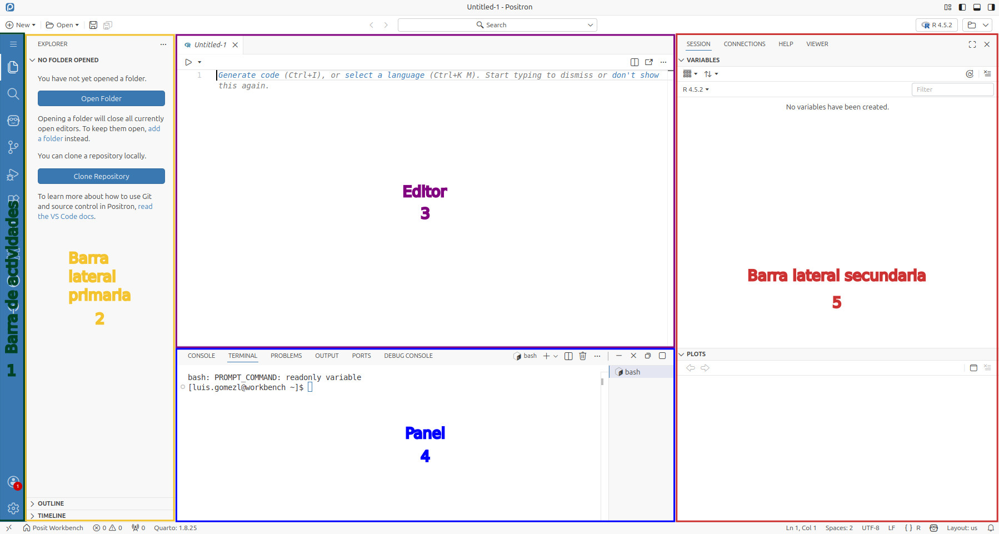

# Bienvenidos a R

Este capítulo se basa en [@ismay_statistical_2025, cap. 1] y tiene como propósito introducir las herramientas fundamentales para el análisis de datos con R. Exploraremos los siguientes aspectos:

1. ¿Qué es R y Positron?
2. ¿Cómo instalar R y Positron o utilizar Posit Workbench?
3. ¿Qué es Quarto?
4. Interfaz de Positron 

## ¿Qué es R y Positron?

En términos simples R es un entorno gratuito para realizar análisis estadísticos y crear gráficos. A lo largo del libro utilizaremos R a través de Positron. R se puede entender como el motor de un automóvil y Positron el tablero de control del automovil que queremos manejar (Ver @fig-1-chap-2).

::: {#fig-1-chap-2 layout="[[48,-4,48]]"}
{fig-alt="Un motor de un automóvil representando a R como el núcleo de procesamiento de datos."}

{fig-alt="Un tablero de control de un automóvil representando a Positron como la interfaz para controlar el motor."}

Analogía para entender la diferencia entre R y Positron
:::

Si abandonamos la analogía anterior y sómos más específicos, R es un lenguaje de programación y Positron es un [*Entorno de Desarrollo Integrado (IDE)*](https://es.wikipedia.org/wiki/Entorno_de_desarrollo_integrado) que incluye un conjunto de elementos en su interfaz para utilizar de manera mucho más fácil R cuando queremos llevar a cabo análisis estadísticos y explorar datos.

## ¿Cómo instalar R y Positron?

::: {.callout-important}
Si formas parte de una institución educativa, verifica si tienes acceso a **Positron Pro** a través de **Posit Workbench** (ver @sec-posit-workbench). En caso de contar con este acceso, no es necesario realizar una instalación local. Por lo tanto, puedes saltarte los pasos de la @sec-install-r y la @sec-install-positron, ya que tendras acceso directo a estas herramientas.

Sin embargo, una vez que te sientas familiarizado con estas herramientas, te recomendamos consultar esas secciones para instalar R y Positron en tu propio computador personal.
:::

### R {#sec-install-r}

Para utilizar R con Positron es necesario primero tener instalado la versión 4.2 de R o una superior. Para instalar R, puedes seguir las instrucciones que aplican para tu sistema operativo en la [página de descarga oficial de CRAN](https://cloud.r-project.org/).

#### Windows

Selecciona el enlace **Download R for Windows**, haz clic en **base** y, finalmente, pulsa en el enlace **Download R X.X.X for Windows**. Ten en cuenta que **X.X.X** representa la versión más reciente disponible al momento de la descarga. Una vez que el archivo `.exe` se haya descargado, haz doble clic en él para ejecutarlo; esto abrirá un asistente con instrucciones en pantalla que te guiará paso a paso hasta completar la instalación.

#### Mac

Selecciona el enlace **Download R for macOS** y dirígete a la sección **Latest release**. Haz clic en el paquete adecuado para la arquitectura de tu Mac (por ejemplo, **R-X.X.X-arm64.pkg** para chips Apple M1/M2/M3, o **R-X.X.X-x86_64.pkg** para procesadores Intel) para descargar el archivo `.pkg`. Ten en cuenta que **X.X.X** representa la versión más reciente disponible al momento de la descarga. Una vez que el archivo se haya descargado, haz doble clic en él para ejecutarlo; esto abrirá un asistente con instrucciones en pantalla que te guiará paso a paso hasta completar la instalación.

#### Linux

Selecciona el enlace **Download R for Linux** y elige la distribución que utilizas (como Ubuntu, Debian, Fedora o Red Hat). A diferencia de otros sistemas operativos, la instalación en Linux se realiza generalmente a través del terminal siguiendo las instrucciones específicas de cada página.

#### Verificando la instalación de R

Una vez instales R es importante que verifiques la instalación. La forma más fácil de hacerlo es dar doble click en el ícono de R (Ver @fig-r-logo) para el caso de Windows o Mac o en Linux abrir el terminal e ingresa `R` en la línea de comandos.

{#fig-r-logo width=20% fig-alt="Ícono del proyecto R"}

Si observas que se abre una ventana con la consola de R (en los casos de Windows y Mac) o que en el terminal aparece el texto de bienvenida de la versión 4.2 o superior (en el caso de Linux), la instalación ha sido exitosa. Para finalizar la verificación, simplemente cierra la ventana de la aplicación en Windows/Mac, o en el caso de Linux, escribe el comando `q()` y presiona la tecla  para salir de la sesión de R en el terminal.

### Positron {#sec-install-positron}

Para utilizar R con Positron, es necesario que primero revises los [requisitos de instalación](https://positron.posit.co/install.html) para asegurar que el programa funcione bien en tu computador. Luego, dirígete a la [página de descarga oficial de Positron](https://positron.posit.co/download.html), acepta el contrato de licencia, descarga el instalador que corresponda a tu sistema operativo (Windows, Mac o Linux) y completa la instalación.

## Posit Workbench {#sec-posit-workbench}

::: {.callout-important}
Si realizaste una instalación local de acuerdo a los pasos descritos en la @sec-install-r y la @sec-install-positron puedes saltarte esta sección.
:::

Posit Workbench es un entorno de desarrollo basado en la nube diseñado para ciencia de datos que puede ser utilizado por las instituciones educativas para enseñanza. Posit Workbench reúne en un solo lugar las herramientas de trabajo más populares para ciencia de datos incluído Positron, ofreciendo un entorno seguro y listo para usar.

Para utilizar esta herramienta, es indispensable contar con una cuenta activa que incluya un usuario y una contraseña proporcionados por tu institución. Una vez que tengas tus credenciales, debes ingresar a la dirección web asignada por tu institución educativa para acceder a la plataforma. Por ejemplo, en la [Universidad Militar Nueva Granada - UMNG](https://umng.edu.co/), el acceso se realiza a través del [portal de ingreso de Posit Workbench de la UMNG](https://positworkbench.umng.edu.co), donde podrás visualizar la interfaz típica para iniciar sesión y comenzar a trabajar.

Antes de comenzar a utilizar R con Positron a través de este entorno, te recomendamos revisar los [requisitos del sistema](https://docs.posit.co/ide/server-pro/user/posit-workbench/guide/requirements.html). Esta verificación previa te permitirá asegurar que tu computador cumplen con las especificaciones necesarias para tener una experiencia adecuada.

## ¿Qué es Quarto?

[Quarto](https://quarto.org/) es un sistema de publicación técnica y científica de código abierto que combina código, resultados y narrativa para generar documentos reproducibles en diferentes formatos (p. ej., HTML, PDF, MS Word), presentaciones, sitios web y proyectos como libros o manuscritos.

Al utilizar Positron, no es necesario instalar Quarto por separado, ya que se integra automáticamente de dos formas:

1. **Como *"motor"* de procesamiento ([Interfaz de línea de comandos](https://quarto.org/docs/cli/index.html))**: es la herramienta interna que transforma tus archivos de texto y código en los reportes y documentos finales.

2. **Como asistente de edición (Extensión denominada [quarto-vscode](https://open-vsx.org/extension/quarto/quarto))**: proporciona las herramientas visuales para trabajar cómodamente, incluyendo el autocompletado de comandos, el resaltado de colores, la ejecución interactiva de código y una vista previa en tiempo real de tus resultados.

::: {.callout-note}
Más adelante profundizaremos en el uso de Quarto utilizando R y Positron. Por ahora te recomendamos familiarizarte primero con la interfaz de Positron (Ver @sec-user-interface-layout) y R. No obstante, si tienes experiencia previa, puedes consultar la [Guía de inicio rápido de Quarto con Positron](https://quarto.org/docs/get-started/hello/positron.html) en la documentación oficial. 
:::

## Interfaz de Positron {#sec-user-interface-layout} 

Si realizaste una instalación local siguiendo los pasos de la @sec-install-r y la @sec-install-positron podras abrir 2 programas. Sin embargo, a lo largo del libro siempre utilizaremos Positron y no la aplicación de R directamente. En la @fig-2-chap-2 se indica que ícono debes dar doble click o que programa abrir en tu computador.  

::: {#fig-2-chap-2 layout="[[48,-4,48]]"}
{#fig-r-icon width=26% fig-alt="Ícono del proyecto R"}

{#fig-positron-icon width=20% fig-alt="Ícono del proyecto Positron"}

Íconos de R y Positron en tu computador
:::

En caso que tengas acceso a Posit Workbench, de acuerdo a lo señalado en la @sec-posit-workbench, sigue los pasos descritos en [Primeros pasos con Positron Pro](https://docs.posit.co/ide/server-pro/user/positron/getting-started/) para abrir de manera directa Positron.

Al utilizar Positron, encontrarás la interfaz organizada como se muestra en la @fig-positron-layout-outline, donde se resalta cada sección de la interfaz. No te preocupes si encuentras pequeñas diferencias o un entorno visual con diferente color dado que los desarrolladores de Positron ésta constantemente actualizando la aplicación o puede que tengas una configuración por defecto diferente en cuanto al entorno visual de la interfaz.

::: {.callout-note}
Si abres Positron por primera vez, verás una pantalla de bienvenida en lugar del **Editor** (Ver @fig-positron-layout-outline). Esto es normal, ya que este espacio se activará automáticamente una vez que abras tu primer archivo de R, un proceso que se señalará más adelante.
:::

{#fig-positron-layout-outline fig-alt="Interfaz de Positron resaltando la barra de actividades, barra lateral primaria, el editor, el panel y la barra lateral secundaria"}

1. **Barra de actividades**: Es tu menú principal. Funciona como un selector de herramientas mediante diferentes iconos. Al hacer clic en cada icono, eliges qué contenido deseas ver en la columna de al lado, permitiéndote cambiar rápidamente entre tus archivos, el buscador, el asistente o cualquier otra funcionalidad que se añada al instalar nuevas extensiones.

2. **Barra lateral primaria**: Es tu ventana de navegación principal y su contenido cambia según el icono que hayas pulsado en la **Barra de actividades**. Por ejemplo, al seleccionar el icono de archivos, este espacio te permitirá abrir una carpeta desde tu computador para visualizar y gestionar todos los documentos y datos con los que vas a trabajar.

3. **Editor**: Es el área central donde abres, escribes y modificas tus archivos. Aquí es donde principalmente redactarás instrucciones en el lenguaje R, permitiéndote crear y organizar el código necesario para tus análisis antes de ejecutarlo.

4. **Panel**: Es el espacio donde se encuentra la consola, que actúa como la vía de comunicación directa con el lenguaje R. Aquí es donde el *"motor"* procesa las instrucciones que envías desde el editor tras ejecutar tu código.

5. **Barra lateral secundaria**: Es tu panel de apoyo y consulta. En este espacio puedes examinar la lista de variables que has creado, visualizar los gráficos generados y acceder a los manuales de ayuda. También sirve para mostrar visualizaciones interactivas o conexiones externas que complementan tu trabajo sin interferir con el código que estás escribiendo.

::: {.callout-tip}
Positron dispone de una [guía oficial](https://positron.posit.co/welcome.html) que detalla cada aspecto de la aplicación. Sin embargo, dominar una aplicación es un proceso gradual que se logra con la práctica constante. En esta etapa inicial, no es necesario conocer todas sus funciones; conforme ganes confianza con la interfaz y según lo requieran tus análisis, podrás consultarla para profundizar en aspectos específicos que requieras.
:::

### Configuración recomendada para principiantes

Existen [diferentes recomendaciones para principiantes](https://github.com/posit-dev/positron/discussions/7527) sobre cómo configurar Positron. Para personalizar tu entorno, debes modificar el archivo de configuración de usuario `settings.json`. Para abrirlo, utiliza la combinación de teclas  dentro de Positron para desplagar la paleta de comandos y escribe: **Preferences: Open User Settings (JSON)**. Luego podras seleccionar ésta opción para abrir el archivo `settings.json`. En este libro, te recomendamos añadir y guardar las siguientes opciones dentro de este archivo:

```json
{
    "workbench.colorTheme": "Default Positron Dark",
    "[r]": {
        "editor.formatOnSave": true,
        "editor.defaultFormatter": "Posit.air-vscode"
    },
    "[quarto]": {
        "editor.formatOnSave": true,
        "editor.defaultFormatter": "quarto.quarto"
    }
}
```

Con estos ajustes lograrás 2 objetivos:

1. **Tema de color:** aplicar la interfaz oscura `Default Positron Dark` para reducir la fatiga visual.

2. **Autoformateo al guardar:** aplicar automáticamente un estilo visual uniforme a tus archivos de R y Quarto utilizando las extensiones [Air](https://open-vsx.org/extension/posit/air-vscode) y [quarto-vscode](https://open-vsx.org/extension/quarto/quarto). Esto permite que el código se reorganice solo, manteniendo una estructura limpia y profesional sin aplicar un esfuerzo manual.

En caso que hayas seguido las instrucciones descritas en @sec-posit-workbench es posible que el administrador de la herramienta previamente haya fijado por defecto éstos aspectos. En caso contrario, puedes agregar ésta configuración.